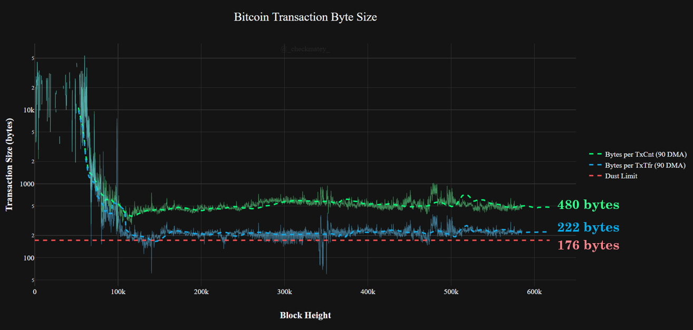
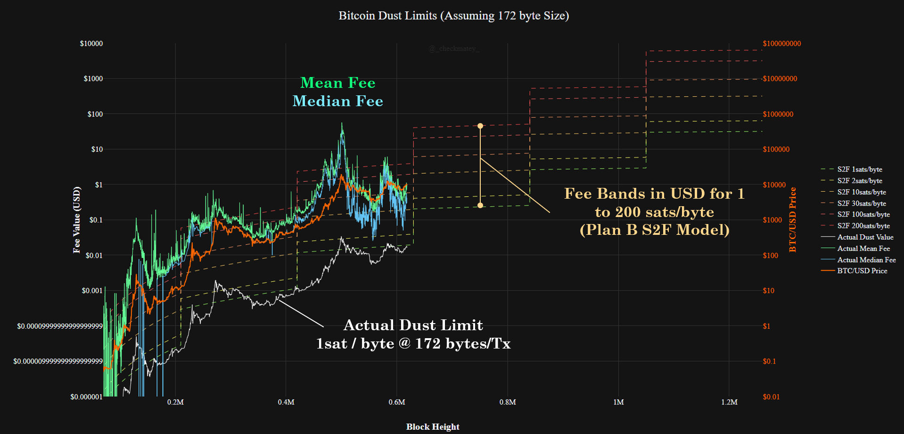

# Forecasting the Bitcoin Fee Market

## Concepts

- Veblen good, as price moves up so does demand (links transactions to Market Cap), assume linear regression
- Market Cap has some natural ceiling height (80T = USD, 100T = Plan B Model, 500T = hyperbitcoinisation)
- Fee pressure builds in USD terms which also constrains demand (relationship between fees and demand?). Assume some maximum acceptable fee ratio to spend (i.e. fee of 1% = 1$ on $100 spend, likely the absolute maximum
- Balance between ff-chain solutions like LN (Assume that the fee limit is a driver for this. Removes transaction fee income for moiners, miners need to sell more, price goes down, cycle repeats))

## Points of Research and Assumptions
- Ceiling market value (total cash, total SoV)
- Limits of a

