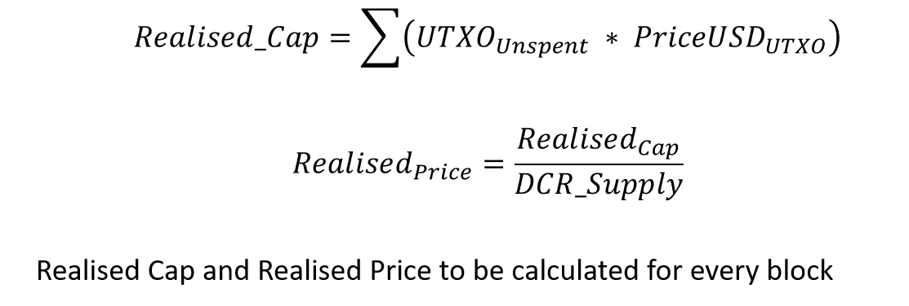
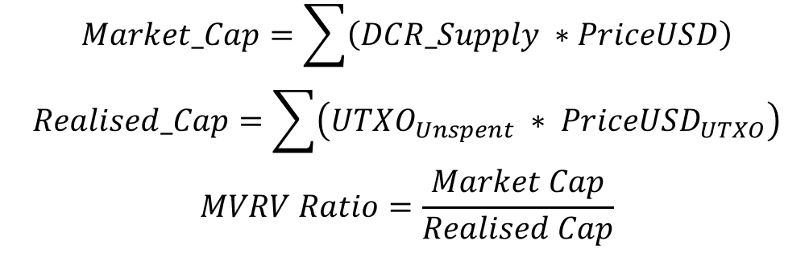

# dcrdata Additional Charts Proposal

## Overview
The following document specifies the input calculations and provides sample charts for a number of Decred specific metrics for implementation into the dcrdata charting suite.

All data is specified considering calculations utilising information understood to be available within dcrdata or dcr.explorer.

## **Primitives Calculations**

The following metrics are referenced in many subsequent calculations and charts and thus represent valuable metrics to develop as primitives within the dataset.

### **The Realised Cap and Price**
Description: 

The Realised Cap is the total sum of all UNSPENT UTXOs priced at the time they were last transacted. The Realised Price is then the Realised Cap divided by DCR circulating Supply.

# Charts

## Realised Cap and MVRV Ratio

Description: 

    The Realised Cap is the total sum of all UNSPENT UTXOs priced at the time they were last transacted. Due to the constant flow of DCR on-chain in Proof-of-Stake tickets, this metric has a different interpretation its equivalent for Bitcoin. The Decred Realised Cap tends to follow price more closely and is 'attracted' to the price during periods of high demand for block-space. This tends to create a level of support in bull markets and resistance in bear markets.

    The MVRV Ratio provides a measure of the relative distance between the market cap and the realised cap.
    For Decred, this behaves as an oscillator for seeking periods of under and overvaluation through bull and bear cycles.

    For more information, refer to the Realised Cap [paper first released by CoinMetrics](https://coinmetrics.io/realized-capitalization/) for more details on the calculation.

Equation:

Inputs:

    Primary Y-Axis
        Market Cap = Coin supply * Coin PriceUSD (Daily close)
        Realised Cap = Sum of Each unspent UTXO priced at the time it last moved

    Secondary Y-Axis
        MVRV Ratio = Market Cap / Realised Cap

Chart Description:

    X-axis      
        Range   = Genesis to present
        Type    = date / block

    Y-axis-Left = Price (USD)
        Range   = 0.1 to 1000
        Type    = log

    Y-axis-Right = MVRV Ratio
        Range   = 0.1 to 10
        Type    = log 

Sample Chart

## Block Subsidy Model (USD and BTC)

Description: 

    The block subsidy models were developed by @permabullnino to capture the aggregate
    income cost basis for the Decred blockchain block reward stakeholders.
    
    The models consider the cumulative value issued by the Decred blockchain in Total (blue),
    to Proof-of-Work miners (red), Proof-of-Stake Stakeholders (purple) and the Decred Treasury
    and Contractor base (yellow). 
    
    These models are priced in both USD and BTC providing key
    psychological levels and cost basis for each set of stakeholders.

Equation:

Inputs:

    Primary Y-Axis
        Market Cap = Coin supply * Coin PriceUSD (Daily close)
        Realised Cap = Sum of Each unspent UTXO priced at the time it last moved

    Secondary Y-Axis
        MVRV Ratio = Market Cap / Realised Cap

Chart Description:

    X-axis      
        Range   = Genesis to present
        Type    = date / block

    Y-axis-Left = Price (USD)
        Range   = 0.1 to 1000
        Type    = log

    Y-axis-Right = MVRV Ratio
        Range   = 0.1 to 10
        Type    = log 

Sample Chart
