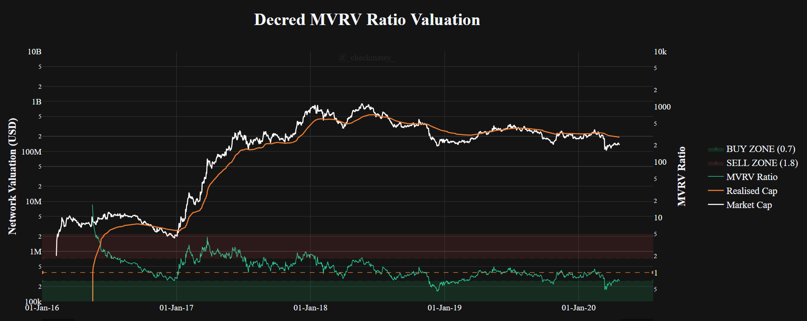
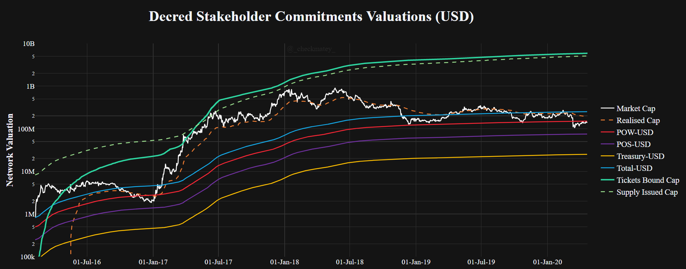
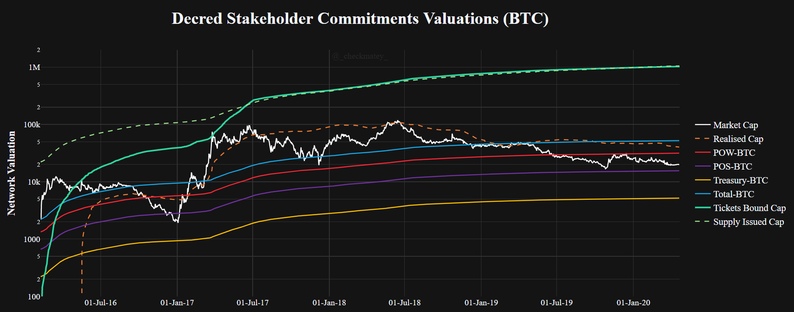
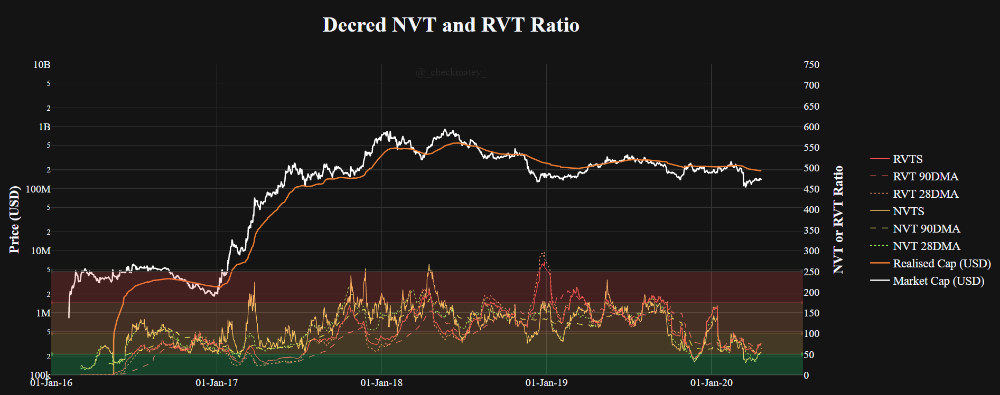
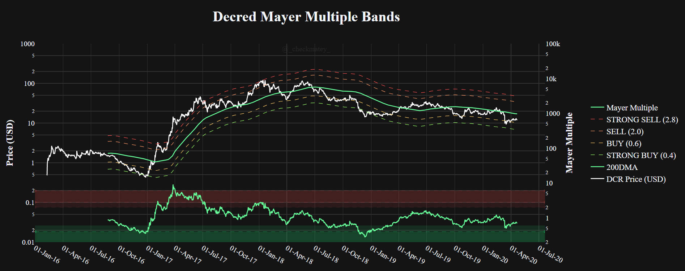

# Checkonchain - Decred Charts

The following document specifies the input calculations and provides sample charts for a number of Decred specific metrics for implementation into a Decred charting suite.

# **Realised Cap and MVRV Ratio**

Checkonchain Code

    checkonchain.dcrcharts.charts.dcr_chart_suite().mvrv(0)

Description: 

    The Realised Cap is the total sum of all UNSPENT UTXOs priced at the time they were last transacted. Due to the constant flow of DCR on-chain in Proof-of-Stake tickets, this metric has a different interpretation its equivalent for Bitcoin. The Decred Realised Cap tends to follow price more closely and is 'attracted' to the price during periods of high demand for block-space. This tends to create a level of support in bull markets and resistance in bear markets.

    The MVRV Ratio provides a measure of the relative distance between the market cap and the realised cap.
    For Decred, this behaves as an oscillator for seeking periods of under and overvaluation through bull and bear cycles.

    For more information, refer to the Realised Cap [paper first released by CoinMetrics](https://coinmetrics.io/realized-capitalization/) for more details on the calculation.

    Data Source: Coinmetrics.io

Links:

[paper by CoinMetrics](https://coinmetrics.io/realized-capitalization/)

[paper by David Puell](https://medium.com/adaptivecapital/bitcoin-market-value-to-realized-value-mvrv-ratio-3ebc914dbaee)

Inputs:

    Primary Y-Axis
        Market Cap      = Coin supply * Coin PriceUSD (Daily close)
        Realised Cap    = Sum of Each unspent UTXO priced at the time it last moved

    Secondary Y-Axis
        MVRV Ratio      = Market Cap / Realised Cap

Chart Description:

    X-axis      
        Range   = Genesis to present
        Type    = date

    Y-axis-Left = Network Valuation (USD)
        Range   = 1e5 to 1e10
        Type    = log

    Y-axis-Right = MVRV Ratio
        Range   = 3 to 20
        Type    = log 

Sample Chart

# **Stakeholder Commitments (USD)**

Checkonchain Code

    checkonchain.dcrcharts.charts.dcr_chart_suite().commitment_usd(0)

Description: 

    The block subsidy models were developed by @permabullnino to capture the aggregate income cost basis for all Decred blockchain block reward stakeholders. These models consider the cumulative value issued by the Decred blockchain in Total (blue),
    to Proof-of-Work miners (red), Proof-of-Stake Stakeholders (purple) and the Decred Treasury
    and Contractor base (yellow). Additionally, the cumulative value bound in Decred tickets (turqoise) represents a psychological level of maximum conviction for Dcered stakeholders.
    
    These models are priced in both USD and BTC providing key psychological levels and cost basis for each set of stakeholders. In general, miners, contractors and investors with cost basis denominated in USD are more sensitive to fluctuations in the DCR/USD cross. Investors and stakeholders with a cost basis denominated in BTC are more sensitive to the DCR/BTC cross.

    Data SOurce: Coinmetrics.io and explorer.dcrdata.org

Links:

[@permabullnino](https://twitter.com/PermabullNino)

[@_checkmatey_](https://twitter.com/_Checkmatey_)

[Block subsidy models paper](https://medium.com/@permabullnino/decred-on-chain-a-look-at-block-subsidies-6f5180932c9b)

[Decred ticket cap paper](https://medium.com/decred/decred-the-resilient-stronghold-4038dc64dd2a)

Inputs:

    Primary Y-Axis (USD Chart)
        Market Cap          = Coin supply * Coin PriceUSD (Daily close)
        Realised Cap        = Sum of Each unspent UTXO priced at the time it last moved
        Total-USD           = Cumulative total block reward paid in USD (DailyIssuedNtV * PriceUSD + FeeTotUSD)_cumsum
        POW-USD             = Cumulative PoW Miner block reward paid in USD 
                                (DailyIssuedNtV * PriceUSD)_cumsum * 0.6 + FeeTotUSD_cumsum
        POS-USD             =   Cumulative PoS Stakeholder block reward paid in USD 
                            (DailyIssuedNtV * PriceUSD)_cumsum * 0.3
        Treasury-USD        =   Cumulative Treasury block reward paid in USD 
                                (DailyIssuedNtV * PriceUSD)_cumsum * 0.1
        Tickets Bound Cap   = Cumulative sum of USD value bound in Tickets
        Supply Issued Cap   = Metric that calculates the 10x total USD issuance corrected for block reward reduction
                                (DailyIssuedNtv * PriceUSD)_cumsum * 10 * (101/100)**(np.floor(block_height/6144))

    For BTC chart - change all PriceUSD to Price BTC

Chart Description:

    X-axis      
        Range   = Genesis to present
        Type    = date

    Y-axis-Left = Price (USD)
        Range   = 1e5 to 1e10
        Type    = log

    Y-axis-Left = Price (BTC)
        Range   = 1e2 to 2e6
        Type    = log

Sample Chart

# **NVT and RVT Ratio**

Checkonchain Code

    checkonchain.dcrcharts.charts.dcr_chart_suite().nvt_rvt()

Description: 

    The NVT and RVT Ratio are metrics that compare the daily value settled in on-chain transactions relative to network market cap (NVT) and Realised Cap (RVT) respectively. Where there is significant demand for block-space relative to network value, the NVT and RVT ratio will be low suggesting undervaluation (and vice-versa). Demand for Decred block-space has historically been dominated by via staking tickets however additional demand arises from privacy mixing and transferring or storing value.

    The 28-day and 90-day moving averages are applicable for short and long term signals. The NVTS and RVTS apply a 28-day moving average only to the numerator (Market Cap or Realised Cap) providing faster signals for short-term traders.

    Data Source: Coinmetrics.io

Links:

[paper on NVT Signal](https://woobull.com/nvt-signal-a-new-trading-indicator-to-pick-tops-and-bottoms/)

[paper on RVT Ratio](https://medium.com/@_Checkmatey_/the-bitcoin-rvt-ratio-a-high-conviction-macro-indicator-615b68715b77)

Inputs:

    Primary Y-Axis
        Market Cap      = Coin supply * Coin PriceUSD (Daily close)
        Realised Cap    = Sum of Each unspent UTXO priced at the time it last moved

    Secondary Y-Axis
        NVT (28DMA)     = (Market Cap / TxTfrValAdjUSD)_28sma
        NVT (90DMA)     = (Market Cap / TxTfrValAdjUSD)_90sma
        NVTS            =  Market Cap / (TxTfrValAdjUSD)_28sma
        RVT (28DMA)     = (Realised Cap / TxTfrValAdjUSD)_28sma
        RVT (90DMA)     = (Realised Cap / TxTfrValAdjUSD)_90sma
        RVTS            =  Realised Cap / (TxTfrValAdjUSD)_28sma
        ZONES           = [175,250] = Red
                          [100,175] = Orange
                          [50,100]  = Yellow
                          [0,50]    = Green

Chart Description:

    X-axis      
        Range   = Genesis to present
        Type    = date

    Y-axis-Left = Network Valuation (USD)
        Range   = 1e5 to 1e10
        Type    = log

    Y-axis-Right = MVRV Ratio
        Range   = 0 to 750
        Type    = linear 

Sample Chart

# **Mayer Multiple**

Checkonchain Code

    checkonchain.dcrcharts.charts.dcr_chart_suite().mayer_multiple()

Description: 

    The Mayer Multiple is a simple oscillator calculated by taking the ratio of the DCR/USD Price to the 200-day moving average. This metric provides a measure of deviation of price from a long term mean which is commonly utilised in technical analysis as a bull/bear support/resistance level.

    Data Source: Coinmetrics.io

Links:
    
    None

Inputs:

    Primary Y-Axis
        DCR Price (USD)     = Coin PriceUSD (Daily close)
        200-Day MA          = 200-day moving average of Price
        Strong Sell (2.8)   = 2.8 * PriceUSD_200sma
        Sell (2.0)          = 2.0 * PriceUSD_200sma
        Buy (0.6)           = 0.6 * PriceUSD_200sma
        Strong Buy (0.4)    = 0.4 * PriceUSD_200sma

    Secondary Y-Axis
        Mayer Multiple      = PriceUSD / PriceUSD_200sma
        ZONES               = [2.8,15]  = Red
                              [2.0,2.8] = Orange
                              [0.4,0.6] = Yellow
                              [0,0.4]   = Green

Chart Description:

    X-axis      
        Range   = Genesis to present
        Type    = date

    Y-axis-Left = Network Valuation (USD)
        Range   = 1e-2 to 1e3
        Type    = log

    Y-axis-Right = Mayer Multiple
        Range   = 0.2 to 1e5
        Type    = log 

Sample Chart

