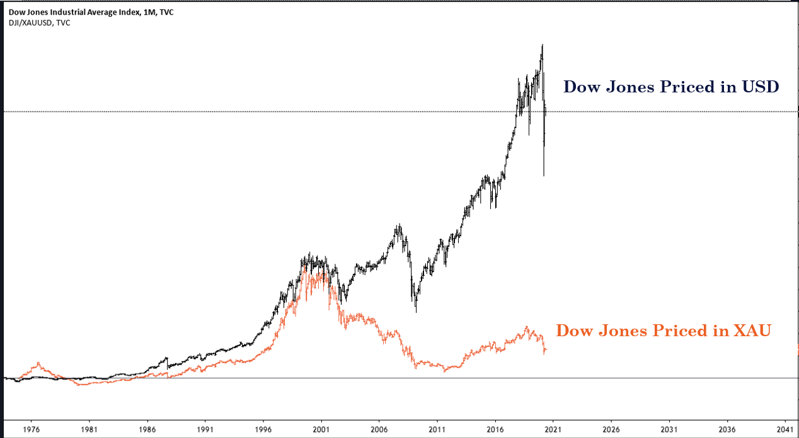
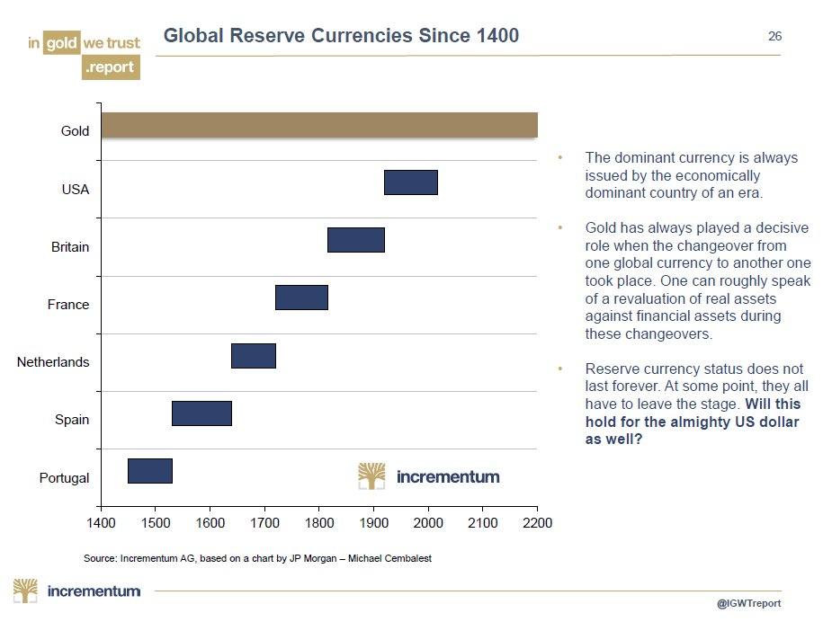
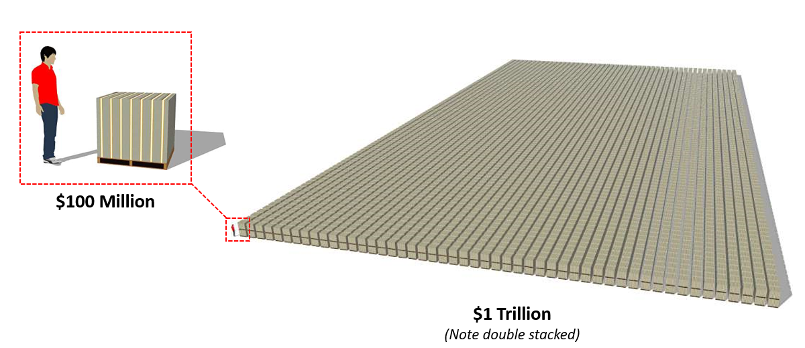
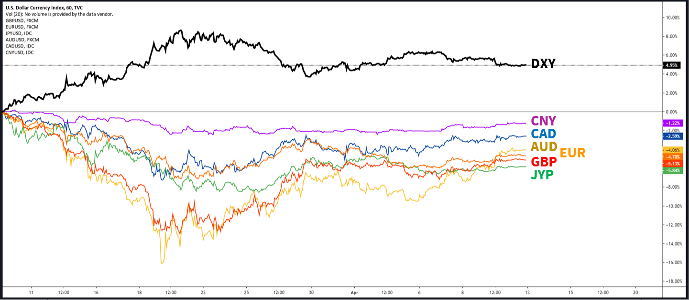

# Decred, Contrarian Competition with Compliments

*This article is written as a distillation of the authors thoughts on the macro economic conditions and the role the author sees Bitcoin and Decred playing as digitally scarce, sound money. This is a long term perspective. The author has no intention of speaking in absolutes, but instead portraying their perceived reality and logic underpinning a specific, and contextualised investment thesis for Decred. None of this shall be considered investment advice and shall be considered only as the opinion of the author*

Traditional markets make no sense and will remain irrational longer than you remain solvent.

Cryptocurrency markets also make no sense, but at least they are free markets.

For anyone peering into this space, it seems like internet funny money driven by naive Millennials, with too much disposable income, and no foresight. Crypto-assets are a market filled with absurd fundamentals and eccentric/missing/anonymous/crooked leaders, whilst touting obscene valuations, especially relative to the technology delivered.

After a number of years in the space, the author has experienced the sane gravity of Bitcoin maximalism. In many regards, it feels like the only thing that makes any sense and has a distinct product market fit.

    > Bitcoin just feels right.

Everything from the cypher-punk roots, the open and fair launch, the sound money properties, the unforgeable costliness and the organic free market process of its rise to dominance. There are an infinite number of critiques leveled at Bitcoin, and the author considers very few of them have any legs to stand on. One must remain open minded to risks and limitations of the design, can only marvel at the simplicity and incentive alignment Satoshi implemented in the Bitcoin protocol.

Whilst his near-maximalist position forms a valuable baseline for interpreting the crypto-asset landscape, the author finds it difficult to believe that there can, and will, only be one winner.

## Winner Takes All

The proposition of a 'winner take all' market for digital money stems from an Austrian economics text-book, and assumes a global convergence to a single, new monetary standard. This seems a rational take at face value and after studying the history of money, but is perhaps, at best, a jump several decades ahead of reality (perhaps more). It also makes two fundamental assumptions that deserve to be challenged:

    1. Bitcoin's characteristics have already, or at least have the potential to, solve the sound money problem of today, tomorrow and ever after.

    2. Bitcoin's network effects within the cryptocurrency market are destined to displace those of the 100yr old United States Dollar and ultimately, the 5000yr old gorilla, Gold.

In fact, the leading argument devout Bitcoiners tend level against alt-coins, is that they could never possibly surpass Bitcoin's reputation, liquidity and network effects and are thus doomed to fail. If this were the case, why do they bet against gold? Global empires and economies have risen and fallen through history, always reverting back to the mean equilibrium, one with a sound monetary base.

For 5000yrs this monetary base has invariably been Gold. Gold is the meter, the second, the Pascal of money. The single reference rate against which all commodities, currencies, goods and services can be valued against as a global standard. The Unit of Account.

    > An ounce of fine gold will always buy you a decent quality suit.

In fact pricing the world in Gold provides a very different reality to pricing it in fiat currencies. The chart below presents the Dow Jones Index priced in USD and XAU since 1980, where the impact of fiat currency devaluation is quite profound. Clearly one money is superior to the other in preserving it's value.

## Money is Competitive

To the initiated, those who have peered behind the fiat money curtain, it is obvious that the pure fiat monetary systems are a blip in human economic history. Tried many times, all with a common outcome. [A strong case has been made](https://www.realvision.com/grant-william-keynote-speech), grounded in history and economic observation, that Gold is the apex predator of money, chosen freely by the market. It has outlasted all fiat currencies and can likely be expected to do so into the future.

**Paper money is an iteration on Gold**, solving for the divisibility and portability constraints of a scarce and heavy metal. This role of divisible, portable Gold was once afforded to [Silver](https://www.investopedia.com/articles/investing/080316/historical-guide-goldsilver-ratio.asp) until paper money superseded it as a technology and decimated its monetary premium in the early 20th century. Modern 'electronic money' is yet another iteration where one's held value is reduced to an entry in a centralised digital database. In effect, 'representative' Gold in the form of paper bank-notes or electronic database entries was sufficiently superior to Silver, and leveraged a sounder, scarcer and more desireable base money, that it completely changed the markets perception of Silver value.

As a result, the Gold-Silver ratio has never recovered to the 1:12 exchange rate used by the Romans nor the rate of 1:15 set by governments through the 19th century. The feature set of paper IOUs on Gold can be concluded to have outcompete Silver as money.

Does this mean Gold is evidence of a winner takes all market?

## Digital Scarcity

Bitcoin is a digital iteration on Gold and a direct response to the extraordinary abuse of power by Central Banks that is granted by unsound paper money. Even a cursory review of the [many negative impacts](https://wtfhappenedin1971.com/) that directly followed the uncoupling of floating fiat currencies, from a sound money base, suggests that a return is sorely needed. At the root of the problem is a set of misaligned incentives that reward opacity, leverage and high time preference behaviour of those close to the minting of fiat money.

    > The discipline of a Gold standard has become absent.

The ingenious design of Bitcoin by Satoshi, can reasonably be argued as a 10x improvement, not only on Gold as a scarce metal, but on the combined system of paper/electronic money built on-top of a Gold base layer. Bitcoin iterated on Gold with:

- Enhanced portability, seizure resistance and is issued as a digital bearer asset via a globally fair distribution mechanism.

- Digital scarcity is enforced through the unforgeable costliness of distributed Proof-of-Work and may perhaps achieve a degree of deterministic scarcity unattainable by atomic metals.

- Self-equilibrating and deleveraging mechanism of the difficulty adjustment algorithm.

- Security, immutability and sustainability assurances achieved via aligned incentives, applied equally to all market participants.

- Transparency of code, ledger audibility and deterministic monetary policy with trivial computation and the asymmetric assurances of cryptography.

It is often said that the core genius of Satoshi's design is the way in which he stitched together many pre-existing ideas to form the cohesive implementation of Bitcoin. By fusing the issuance, distribution and payment infrastructure of a verifiably scarce asset, with the portability of data on the internet, one could argue that Bitcoin's feature set

It was the author's discovery of Decred that crystalised this opinion, and to such a great extent, that the author now considers it one of the ultimate beneficiaries of what is likely to be the greatest economic shift in history.

As a wise man once said, 'Bitcoin changed the way I think about money, but Decred changed the way I think about cryptocurrencies.'

*The remainder of this article aims to be a distillation of a contextualised bull case for Decred and why it is one of the soundest, hardest and most undervalued crypto-assets in the market. None of this shall be considered investment advice and shall be considered only as the opinion of the author*

## Decred the Contrarian

DECRED FORCES BITCOIN TO REMAIN COMPETITIVE

There is a characteristic of the Decred community that is less common in the dogmatic ideas of many alt-coin communities. Decred-heads are open to the reality where Bitcoin succeeds or doesn't. Decred is constructed, purposed and tooled both to catch the slack and 

If miners are captured by nation states, Decred tickets will be owned by the people

## Sound Money Backdrop

Outside the microscopic $200B bubble of crypto-currencies, the most hostile monetary environment in living history is playing out around us. Biblical debt levels permeate households, corporations and governments and nominal unemployment numbers are swelling beyond anything we have ever seen.

Human instincts to preserve what scarce savings have been accumulated are beginning to kick in, as the reality of a what a global shut-down actually means for the future. Continued exponential growth is probably not on the cards. A macro shift is underway as the baby boomer generation transition from a lifetime as net buyers of assets via their retirement funds, to the largest group of net sellers in history.

We are likely at the start of a great unwinding, from a multi-decade boom of credit accumulation within equity, derivative and bond markets. This is otherwise known as 'the good times'.

So large is the problem at hand that governments and central banks have now deployed the central bank bazooka of 'unlimited' quantitative easing and liquidity injection. 

In response to this crisis, the money printer goes brrrr....to the tune of (multi-)Trillions of US Dollars...and this is Act I Scene I.

To contextualise, a single Trillion dollars is equivalent to:

- $1 per second for 31,709 years (start your counting in the Stone Age).
- more than 5x World War I (nominal terms assuming ~$186B in direct costs [[1]](http://www.digitalhistory.uh.edu/era.cfm?eraid=12&smtid=1), [[2]](https://spartacus-educational.com/FWWcosts.htm))
- 19,440 metric tonnes of gold priced at $1650/t oz (2.4x the U.S Reserves at Fort Knox)
- 10,000 Pallets of $100 Bills [[3]](https://www.pagetutor.com/trillion/index.html)

## A Speculative Bubble, Doomed to Fail

In this extraordinarily adverse economic climate, why on earth would anyone invest in cryptocurrencies and especially anything outside Bitcoin? What rational position is there to hold an even more speculative crypto-asset like Decred? Nobody in their right mind would do this...right?

The obvious answer in this case of course not. Go on about your day and maintain the assumption that Bitcoin, Decred and crypto-assets are a speculative bubble and destined to collapse to zero. There can be no demand under these circumstances.

For those who have looked behind the curtain of modern finance, it is impossible to un-see the man behind it. The veil is being pulled and the transition beyond a fiat monetary system is a train that none of us can stop.

The Genie Satoshi released is out of the bottle and the time is now.

The largest speculative bubble in history has popped and the air of 'stable' fiat currency systems is coming to it's logical conclusion. For those who study history, it was always doomed to fail for one simple reason, the very same that collapsed every major empire.

The incentives were all wrong.

## The Sound Money Backdrop

An immense geopolitical game of chess is underway which evolves around the dominance of the United States petro-dollar (USD). Since the Bretton-Woods agreement, the world has been reliant on reserves of USD to 

'Alt-fiat' currencies are being savagely devalued against the US Dollar as nations struggle to bring the reserve currency in due to the supply AND demand shock brought on by the COVID-19 virus. As a result, monetary expansion in local currencies continues and the USD strengthens.

It is likely this trend will continue, as society desperately attempts to settle their USD denominated debts and access USD petrodollars for essential commodities at the expense of local currency value.

One could not concoct a more bullish scenario for sound money to thrive if they tried. "Unlimited" quantitative easing and liquidity injections by Central Banks culminates in the global phenomena of privatised gains, socialised loses. Accountability and trust in institutions are nowhere to be seen.

The digitisation of 'data-collecting' fiat currencies, and the banning of privacy preserving, 'data-less' cash is more or less inevitable. A Universal basic income or wage subsidy is likely to persist for many of the workplaces displaced as new efficiencies in capital allocation and automation come to fruition.

In this environment of almost guaranteed long term price inflation and surveillance capitalism, privacy preserving, digital sound money becomes an extremely compelling and frankly, sane bet.

DOLLAR IS TOO STRONG

## Winner Takes All.

Does it?

Gold remains the historical leader with 5000yrs of network effects and brand recognition. Already intertwined with the central bank financial system, it has served society as the safe haven, inflation hedge though periods of historical uncertainty.

Imposition of some gold backed digital currency is becoming increasingly likely, spearheaded by the East, with intent to undermine the hegemony of the USD petrodollar. This is a macro positive move back to sound money.

It is almost an expected outcome as the world reaches the logical conclusion of a pure fiat monetary system.

Crypto-assets battle for mind-share, relevance and dominance in a competitive landscape for new digital money. Bitcoin's market share and reputation continues to overshadow all others, and the maximalist position posits that this is the case in perpetuity.

## Context

At its core, Why Byt DCR? What is the value proposition over Bitcoin?

Comes down to providing a digital store of value, constructed under the exact contrarian design to Bitcoin. It takes everything Bitcoin advocates hold near and dear and bets against it.

Difference in ledger assurances and security guarantees

Both Bitcoin and Decred are bets on human intelligence, they just go about the process of enabling that intelligence in polar opposite directions.

**Winner takes all?**
The underlying assumption that Bitcoin can displace gold can equally be leveled at Bitcoin by Decred.

It is a question of time horizon. In the long term, gold displaced silver. However Fiat almost entirely displaced gold for the majority of living history. Gold-bugs have been wrong since 1971. Conditions are an imposed market for money by governments.

Central Bank Digital Currencies - move away from dollar standard

Fairness and transparency. How are decisions made (miners, nodes, developers) and Decred adds in stakeholders. There is no clear picture for Bitcoin.

- Store of Value
- Digitisation
- Convenience and Global
- Bearer Assets

- Hedge against Central Banks
    - Record money Printing
    - ZIRP
    - Surveillance Capitalism

The underlying assuption of winner takes all is that there is only one way to do things

    - Pro
        - Gold was WTA
        - Liquidity begets Liquidity
        -
    - Against
        - Assumes that because Gold exists, equity is not a SoV
        - Allocation to a single asset just doesn't exist
        - 

At the end of the day, these assets are software and the ease of accepting a multitude as payments is near trivial. Serving different features, the best privacy solution for Bitcoin could be DCR.

## Competitive

- Sound Money is a battleground
    - Network effects
    - Attention
    - Liquidity

- Retains sound money characteristics
    - Bitcoin is Predictably Unchangeable
    - Decred is Predictably Decisive

- Hedge against Bitcoin Failures
    - Hybrid Consensus
    - Pure PoW (Centralisation of Hardware and Mining)
    - Rough Consensus
        - How and who makes decisions on Consensus Rules
        - Upgrades, Bugs, new technology
    - Security of what gets added to the codebase
        - Removes ambiguity and adds decisiveness
    - Evolution vs Stagnation
    - Entrenched value and development
    - Hedge against entrenching BTC in financial infrastructure

- Pure PoW
    - Governments outcompete corporations in a money system
    - Decred Tickets as a resistance mechanism

- Perfect Contrarian approach to Sound crypto-assets 
    - Decred contractors and the DAO
    - Layering Human and Machine Consensus
    - Edison vs Tesla on Governance

- Politeia and organisation
    - Identity
    - Verification 
    - Storage
    - Custody
    - Payments

Decred is a bet on a full stack sound money
SDR/Libra

CHART OF DECRED VS BITCOIN VS SUPPLY AGE

## Complimentary

- Two way street
    - DEX Liquidity
    - Privacy Mixing
    - 

- Hedge
    - Unlikely world will allocate full reserve to one asset
    - Insurance - You don't appreciate it until you need it

- High Assurance settlement Layer adjacent to Bitcoin
    - Excess demand 