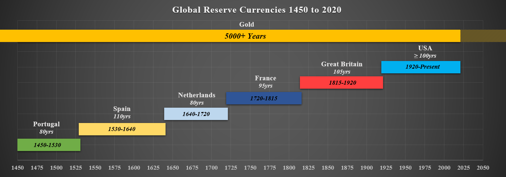
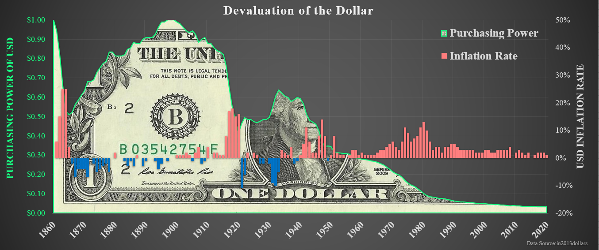
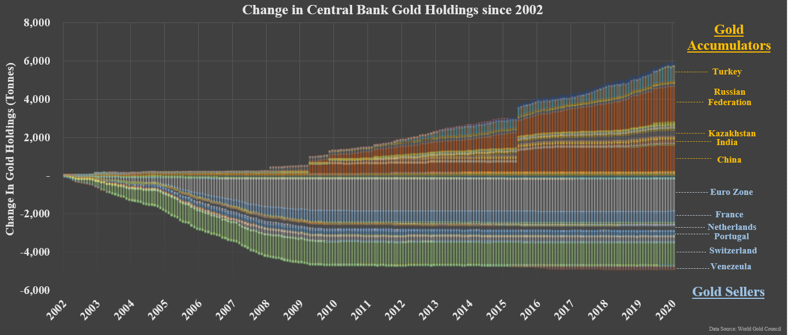

# Decred, The Contrarian Competition, with Compliments

Traditional markets make no sense. They can and will remain irrational longer than you can remain solvent.

Cryptocurrency markets can often make no sense, but at least they are objectively free.

For anyone peering into the cryptocurrency space, it seems like internet funny money driven by naive Millennials, with too much disposable income, and no foresight. Crypto-assets are a market filled with absurd fundamentals and eccentric / missing / anonymous / or crooked leaders, whilst simultaneously touting obscene valuations, especially relative to the tangible technology delivered.

After a number of years in the space, the author has experienced the sane gravity of Bitcoin maximalism. In many regards, it feels like one of the only models that makes sufficient sense with a distinct product market fit.

    > Cryptocurrency forces the hand of government into abiding by the fiscal discipline imposed by sound money, and Bitcoin just feels right.

Everything from the cypher-punk roots, the open and fair launch, the sound money properties, the unforgeable costliness and the organic free market process of its rise to dominance. There are an infinite number of critiques leveled at Bitcoin, and the author considers very few of them have any legs to stand on. One must remain open minded to risks and limitations of the design, but can only marvel at the simplicity and effectiveness of incentive alignment Satoshi implemented in the Bitcoin protocol.

    > Bitcoin works because the human incentives of greed and self-interest are persistent across time and space.

Whilst this near-maximalist position forms an invaluable baseline for interpreting the crypto-asset landscape, the author finds it difficult to believe that there can, and will, only be one winner. The remainder of this article will detail the logic and reasoning which underpins this opinion and why the author firmly believes that Decred stands as Bitcoin's most complimentary competition.

## Winner Takes All?

The proposition of a 'winner take all' market for sound money stems from the central tenants of an Austrian economics text-book. It posits that a global convergence to a single monetary standard is inevitable. After considering the history of money, and in particular Gold's role in it, this seems a rational and intuitive take.

For a digital disruption of money however, it is perhaps a jump several decades ahead of reality to assume this is the outcome, and even further to assume Bitcoin to be the only winner. This thesis also makes three fundamental assumptions which deserve to be challenged:

    Assumption 1: Bitcoin, as a zero to one technology, boasts a feature set, network effect and liquidity pathway that is so strong, it is destined to displace those of the 100yr old United States Dollar and ultimately, the 5000yr+ old gorilla, Gold.

    Assumption 2: Bitcoin's characteristics have already, or at least have a great probability to, solve the sound money problem of today, tomorrow and ever after, making it effectively undisruptable.

    Assumption 3: The market and process of open source, rough consensus governance will find a way to resolve all future conflicts and constraints regarding the evolution of the Bitcoin software.

The leading argument Bitcoiners level against alt-coins, is that irrespective of features, no alt-coin could ever possibly surpass Bitcoin's reputation, liquidity and network effects and are thus doomed to fail.

If this were the case, why do they bet on Bitcoin in a competition against Gold? 

Gold-bugs, usually from the same Austrian school of thought as Bitcoiners, can be forgiven for considering Bitcoin a shitcoin. Monetary metals have effectively been a winner takes all market and the liquidity, reputation and network effects of Gold are orders of magnitude greater than that of Bitcoin. The characteristics and scarcity of Gold outcompete all other forms of money to date. Furthermore, there is little evolution possible to enhance Golds intrinsic properties, and therefore little to disrupt the balance...

...that is of course until a new paradigm arises where monetary metals must compete with digital scarcity protocols for market-share.

## Money is a Competitive Landscape

For students of history who peer behind the fiat money curtain, it becomes obvious that this pure fiat monetary system is but a a blip in human economic history. Global empires, economies and sovereign currencies have risen, and fallen many times over, most often reverting to or being overtaken by a new economic equilibrium with a sound monetary base.

For 5000yrs+ that monetary base has invariably been Gold.

Gold is the datum, the meter, the second, the Pascal, of money. The single reference rate against which all commodities, currencies, goods and services can and have been valued against as a global standard for centuries. Gold is humanities long term **Unit of Account**. As the saying goes:

    > An ounce of fine gold will always buy you a decent quality suit.

Gold has consistently served its purpose as a scarce, sound store of value through all manner of economic realities, ranging from deflation to hyper-inflation. [Grant Williams summarised the convincing case](https://www.realvision.com/grant-william-keynote-speech) of Gold as the apex predator of money, chosen freely by the market and outlasting all past attempts at pure fiat currencies. Given the reliability of human greed, and the incentive to abuse and devalue unsound monies, it is reasonably expected that Gold shall continue to be so long into the future.

**Paper money is an iteration on Gold**, solving for the divisibility, and portability constraints of a scarce and heavy metal. Paper money benefits from the abstraction of a sound base money, a role once afforded to [Silver](https://www.investopedia.com/articles/investing/080316/historical-guide-goldsilver-ratio.asp) until paper money superseded it as a technology, and decimated its monetary premium.

In effect, 'representative' Gold in the form of paper bank-notes, and the expansion of fractional lending it enabled, was sufficiently superior to Silver that it changed the markets perception of its value and necessity. The Gold-Silver ratio has never recovered, with a present exchange rate nearing 1:110, a far cry from the fixed rate of 1:15 set by centralised authorities as far back as the Roman empire.

    The feature set of paper claims over Gold, definitively outcompete Silver as money.

After the USA severed the gold standard completely in 1971, modern fiat money has lost all sound backing, essentially becoming an abstraction of the issuing governments liabilities. This purely fiat based system has now been the dominant form of money through the majority of living memory, making recollections of a Gold standard few and far in between. 

**Modern 'electronic money' is an iteration on paper money**, where monetary value has been reduced to an account entry in a centralised database. Bank accounts and electronic money affords holders the convenience of global payments, tap and go credit and access to business conducted over the internet. This makes for a superior medium of exchange to its paper and physical Gold predecessors. However, it is a provably woeful tool for wealth preservation. Central Banks, governments and financial institutions have excelled in their ability to devalue fiat currency at ever increasing rates.

    "With the exception only of the period of the gold standard, practically all governments of history have used their exclusive power to issue money to defraud and plunder the people." - Hayek

With the clarity of historical hindsight, it is expected that this purely fiat regime is temporary and has an expiration date. The most rational assumption of a winner-takes-all thesis, would be that history repeats and the fatal flaws in unsound paper/electronic money will be outcompete by the reigning champion of sound money, Gold. In fact, the incentive and momentum behind such a reality is becoming increasingly apparent, observable in the balance of Gold accumulation and investment patterns of the world's Central Banks. *(Further exploration of this point is outside the scope of this paper, although the author recommends [this presentation]((https://www.youtube.com/watch?v=GEwuGHFF7qE)) for those looking to dig deeper)*.

## Absolute Digital Scarcity

**Bitcoin is a digital iteration on Gold** and a direct response to the extraordinary abuse of power by Central Banks, granted by unsound fiat money. Even a cursory review of the [negative impacts](https://wtfhappenedin1971.com/) that followed the uncoupling from sound money, suggests that a return is sorely needed. At the root of the problem are a set of misaligned incentives that reward and motivate institutional opacity, excessive leverage and high time preference behaviour, as citizens seek an escape from perpetual currency debasement.

The ingenious design of Bitcoin by Satoshi is a remarkable improvement, not only on Gold as a scarce commodity, but on the combined distribution system and bearer asset of paper (or electronic) money built on-top of a Gold base layer. The reason Bitcoin is so important to our future is in the elegant and remarkable combination of ways it iterated on Gold:

- Enhanced portability, seizure resistance and storage capabilities afforded by public-private key cryptography.

- Issuance as a digital bearer asset via a permissionless, globally accessible, competitive, and provably fair distribution mechanism in Proof-of-Work.

- Absolute digital scarcity enforced through the unforgeable costliness of energy burn and a social contract enforced by a network of high redundancy of nodes. Perhaps this system achieves an absolute scarcity that is actually unattainable by atomic metals.

- Self-equilibrating and deleveraging mechanism of the difficulty adjustment providing a reliably deterministic issuance of supply.

- Security and immutability assurances achieved via aligned incentives, applied equally to all market participants.

- Transparency, verification of authenticity and ledger audibility via trivial computation due to the asymmetric assurances of cryptography.

It is often said that at the core of Satoshi's genius design, is the way he stitched together many pre-existing ideas to form the cohesive implementation of Bitcoin. By fusing the issuance, distribution and payment infrastructure of a verifiably scarce asset, with the portability of data on the internet, one could argue that Bitcoin's feature set has all the properties required to outcompete Gold as a future sound money base.

## First Mover Advantage

Given the almost unbelievable advantage Bitcoin has in features over Gold, it leaves little doubt to why Bitcoiner's believe it to be the ultimate successor. In the same way paper money usurped the throne from physical Gold, and electronic money after it, technological advantages of this magnitude may precipitate a phase change.

Bitcoin enters the fold not only with enhanced distribution, transparency and audibility, but with an absolute scarcity that trumps Gold on its most valuable sound money characteristic. Add to this the relative liquidity, reputation and size of Bitcoin amongst it's digital peers and its success can feel inevitable.

What chance do altcoins stand? The market has proven to date that simply iterating from one to ten on technology has not swayed Bitcoins dominance and Bitcoin maximalism has since become a powerful religion. The first mover advantage and zero to one nature of Bitcoin is undoubtedly the most likely disruptor of Gold.

## The Risk Free Asset

Sound money should be a risk free asset. Somewhere to park capital and value with confidence its scarcity cannot be tampered with and inflated arbitrarily. It should be reliably consistent and its future state as deterministic as possible.

It was the author's discovery of Decred that crystalised this opinion, and to such a great extent, that the author now considers it one of the ultimate beneficiaries of what is likely to be the greatest economic shift in history.

As a wise man once said, 'Bitcoin changed the way I think about money, but Decred changed the way I think about cryptocurrencies.'

*The remainder of this article aims to be a distillation of a contextualised bull case for Decred and why it is one of the soundest, hardest and most undervalued crypto-assets in the market. None of this shall be considered investment advice and shall be considered only as the opinion of the author*

## Decred the Contrarian

DECRED FORCES BITCOIN TO REMAIN COMPETITIVE

There is a characteristic of the Decred community that is less common in the dogmatic ideas of many alt-coin communities. Decred-heads are open to the reality where Bitcoin succeeds or doesn't. Decred is constructed, purposed and tooled both to catch the slack and 

If miners are captured by nation states, Decred tickets will be owned by the people

DECRED IS A PASSPORT

## Context

At its core, Why Byt DCR? What is the value proposition over Bitcoin?

Comes down to providing a digital store of value, constructed under the exact contrarian design to Bitcoin. It takes everything Bitcoin advocates hold near and dear and bets against it.

Difference in ledger assurances and security guarantees

Both Bitcoin and Decred are bets on human intelligence, they just go about the process of enabling that intelligence in polar opposite directions.

**Winner takes all?**
The underlying assumption that Bitcoin can displace gold can equally be leveled at Bitcoin by Decred.

It is a question of time horizon. In the long term, gold displaced silver. However Fiat almost entirely displaced gold for the majority of living history. Gold-bugs have been wrong since 1971. Conditions are an imposed market for money by governments.

Central Bank Digital Currencies - move away from dollar standard

Fairness and transparency. How are decisions made (miners, nodes, developers) and Decred adds in stakeholders. There is no clear picture for Bitcoin.

- Store of Value
- Digitisation
- Convenience and Global
- Bearer Assets

- Hedge against Central Banks
    - Record money Printing
    - ZIRP
    - Surveillance Capitalism

The underlying assuption of winner takes all is that there is only one way to do things

    - Pro
        - Gold was WTA
        - Liquidity begets Liquidity
        -
    - Against
        - Assumes that because Gold exists, equity is not a SoV
        - Allocation to a single asset just doesn't exist
        - 

At the end of the day, these assets are software and the ease of accepting a multitude as payments is near trivial. Serving different features, the best privacy solution for Bitcoin could be DCR.

## Competitive

- Sound Money is a battleground
    - Network effects
    - Attention
    - Liquidity

- Retains sound money characteristics
    - Bitcoin is Predictably Unchangeable
    - Decred is Predictably Decisive

- Hedge against Bitcoin Failures
    - Hybrid Consensus
    - Pure PoW (Centralisation of Hardware and Mining)
    - Rough Consensus
        - How and who makes decisions on Consensus Rules
        - Upgrades, Bugs, new technology
    - Security of what gets added to the codebase
        - Removes ambiguity and adds decisiveness
    - Evolution vs Stagnation
    - Entrenched value and development
    - Hedge against entrenching BTC in financial infrastructure

- Pure PoW
    - Governments outcompete corporations in a money system
    - Decred Tickets as a resistance mechanism

- Perfect Contrarian approach to Sound crypto-assets 
    - Decred contractors and the DAO
    - Layering Human and Machine Consensus
    - Edison vs Tesla on Governance

- Politeia and organisation
    - Identity
    - Verification 
    - Storage
    - Custody
    - Payments

Decred is a bet on a full stack sound money
SDR/Libra

CHART OF DECRED VS BITCOIN VS SUPPLY AGE

## Complimentary

- Hedge
    - Unlikely world will allocate full reserve to one asset
    - Insurance - You don't appreciate it until you need it

- High Assurance settlement Layer adjacent to Bitcoin
    - Excess demand 

- Decred benefits from Bitcoin (Like having a protective older sibling)
    - Attention
    - DEX Liquidity
    - USD valuation of Treasury

- Bitcoin benefits from Decred (Like having a dependable younger sibling)
    - DEX Liquidity
    - Privacy Mixing
    - Off-Bitcoin Settlement assurance
    - LN Integrations
    - 