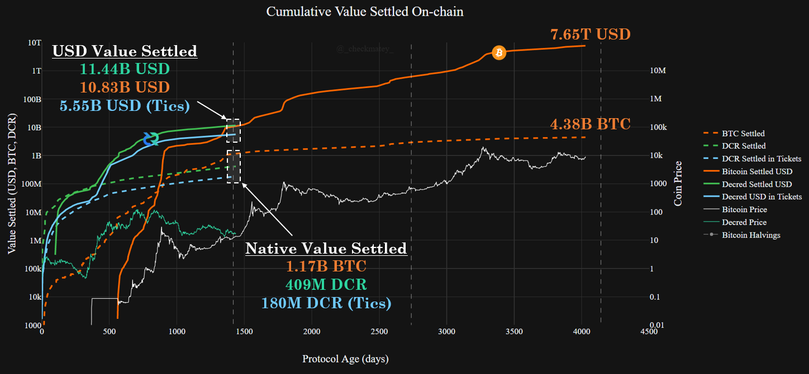
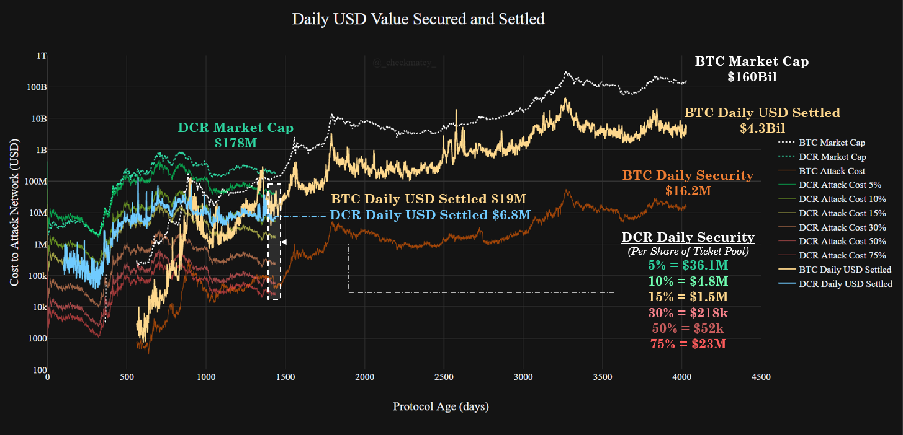
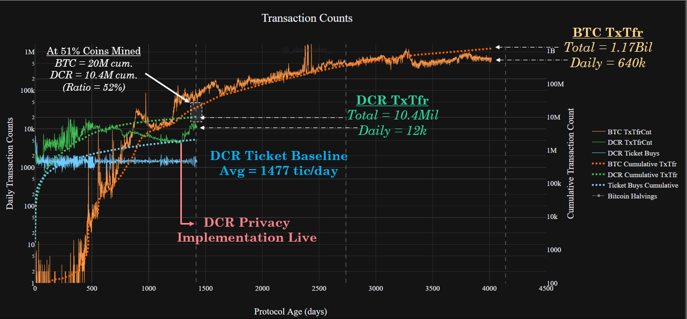
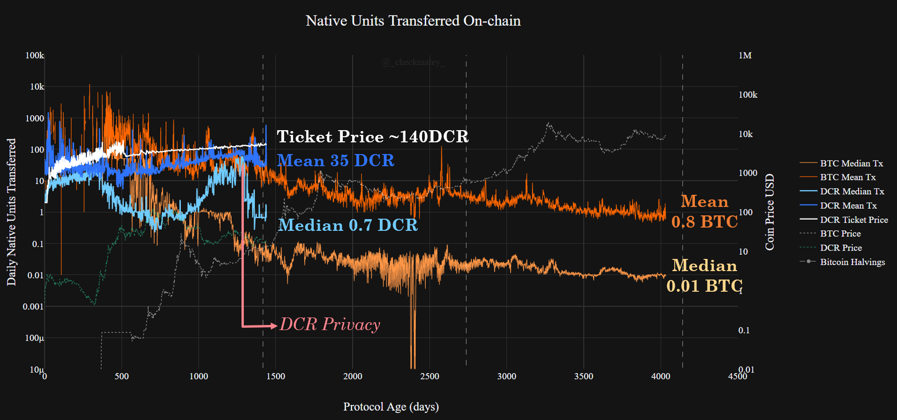
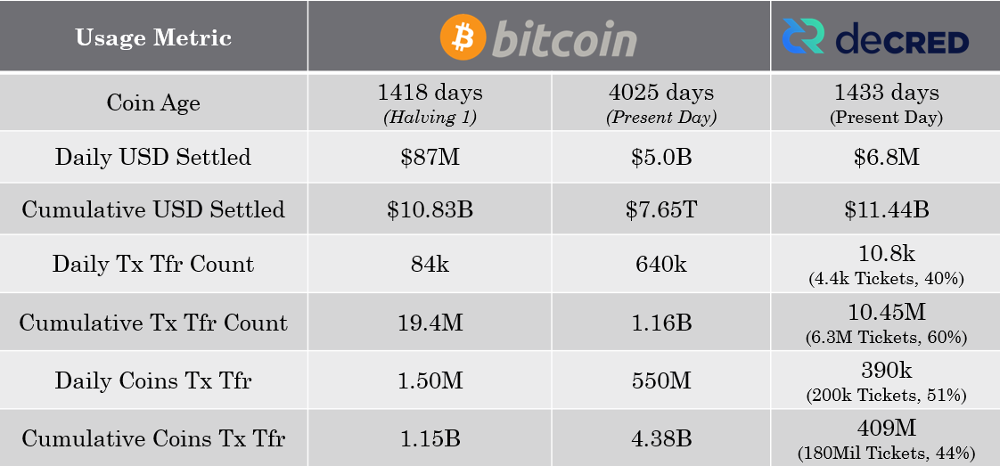
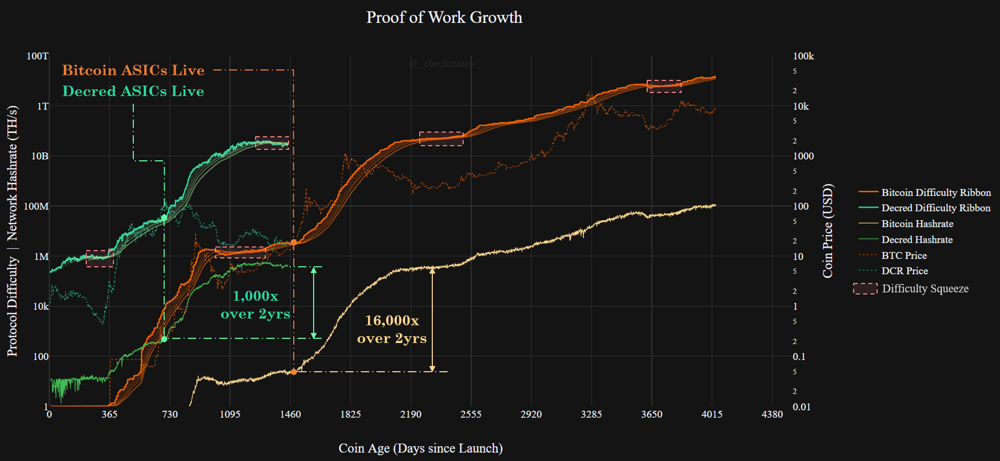
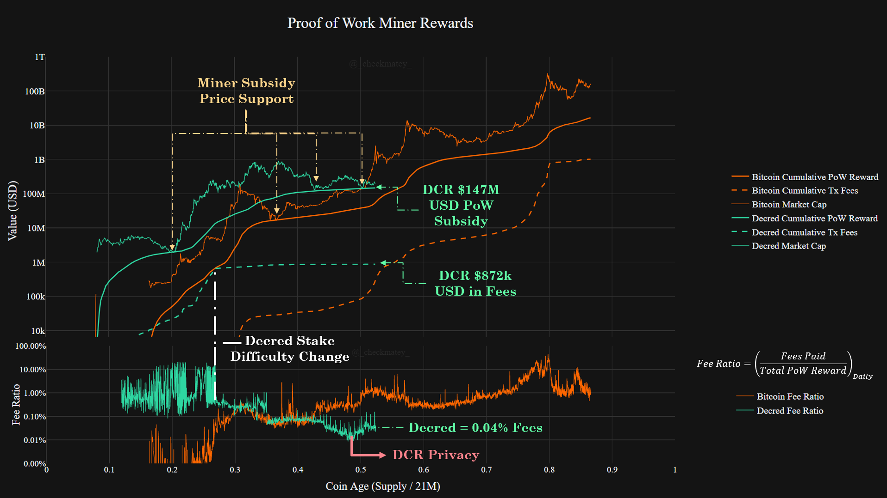

# Decred, The Resilient Stronghold
*by Checkmate*

*30-Jan-2020*

**Decred** is one of the most promising cryptocurrency projects and a sound competitor next to Bitcoin in the free market for scarce digital money. At a minimum, strong market competition forces innovation and hardening of the strongest protocols whilst also providing a rational hedge for risk during the nascent development of digital money.

The following article is the final part of a three-part study into Decred from a data-driven and first principles perspective. The series aims to critically compare the performance of both Decred and Bitcoin across the following value metrics:

1. [Monetary policy and Scarcity](https://medium.com/@_Checkmatey_/monetary-premiums-can-altcoins-compete-with-bitcoin-54c97a92c6d4)
2. [Cost of Security and Unforgeable Costliness](https://medium.com/@_Checkmatey_/decred-hypersecure-unforgeably-scarce-e076b91a2be)
3. Governance, User Adoption, and Resilience (this paper)

[*Background image courtesy of NASA*](https://www.nasa.gov/sites/default/files/styles/full_width_feature/public/thumbnails/image/iss052e007857.jpg)

# Overview

In this paper, I explore the **resilience, adoption and aggregate behaviour**  of key participants in the Decred network. Decred's incentive structure is unique amongst cryptocurrency protocols, engaging the attention and action of four parties, each with a critical role in sustaining network health:

- **Users** who utilise DCR as an uncensorable and self-sovereign means for storing and transferring wealth.

- **Proof-of-Work Miners** who provide unforgeable ledger security and construction of the blockchain.

- **Proof-of-Stake Stakeholders** who provide checks and balances to PoW security and protocol governance decisions.

- **Proof-of-Skill and Time Builders** who develop, research and disseminate technology, knowledge and awareness to enhance the Decred value stack.

## Skin-in-the-Game

In many instances, individuals participating in the Decred network are active in more than one of these categories, in some cases all four. 

It is not uncommon for Miners, who have invested heavily in both CAPEX and OPEX to compete with ASIC hardware, to take an active interest in governance decisions to protect their investment. This also provides a passive, income stream for mined coins whilst hodling, enabling unique revenue models.

The people who contribute to and develop the Decred codebase, market presence and research base, are typically strong hand holders of DCR and active participants in Proof-of-Stake security and governance. Having developed sound understanding of Decred fundamentals, these people are often motivated and dedicated DCR hodlers of last resort.

These examples are distillations of an essential yet informal value of Decred holders, skin-in-the-game. The Decred design is centred around the fundamentally crypto-anarchic principles of action and accountability of the system whilst preserving the individual's privacy and anonymity. 

> Decred is a crypto-anarchic society. 
> The whole is stronger than the sum of it's parts.
> Yet it protects, secures and obscures each at an individual level.

This paper studies this aggregate behaviour driven by individal skin-in-the-game for all four user categories. It aims to describe how the **Decred** blockchain has performed as a whole over time.

## TL; DR
- X

- X

- X

## Disclosure

*This paper was written and researched as part of the author's [research proposal](https://proposals.decred.org/proposals/78b50f218106f5de40f9bd7f604b048da168f2afbec32c8662722b70d62e4d36) accepted by the Decred DAO. Thus, the writer was paid in DCR for their billed time undertaking the research. Nevertheless, the study aims to be objective and mathematically rigorous based on publicly available market and blockchain data. All findings can be readily verified by readers in the attached [spreadsheet](X) and all assumptions shall be clearly stated.*

# UPDATE SPREADSHEET

# 1) The Immutable Wealth of DCR Holders

At it's core, Decred aims to provide an immutable, uncensorable and self-sovereign store of value in the DCR crypto-asset. Decred's hard-coded, supply cap and deterministic monetary policy make it a valid contender in the landscape of digital stores of value. 

With growing market size and increasing network decentralisation, Decred now boasts an impressive security system. This provides users with a set of unique [assurances for resistance against ledger tampering, block re-organisations and double spends](https://medium.com/@permabullnino/introduction-to-crypto-accounting-an-analysis-of-decred-as-an-accounting-system-4d3e67fce28). Decred's Hybrid PoW/PoS consensus mechanism thus acts to secure user wealth held in DCR, settle value transferred over the ledger and uphold these immutable characteristics.

## Resistance to Reorganisations

The Decred protocol is four years old and impressively has experienced very few blockchain reogranisations through history. Re-organisations to a depth of one block are natural phenomena  in blockchains (including Bitcoin) as a result of network latency and probability and usually work themselves out. As of block height 414,977, the following [block re-orgs have been detected](https://matrix.to/#/!vGasNHFXqjoEWUBTIi:decred.org/$157910732378277MwoqT:decred.org?via=decred.org&via=matrix.org&via=zettaport.com) with the majority of depth 2 and all of depth 3 being associated with a [bug encountered during the DCP004 upgrade](https://matheusd.com/post/dcp0004-and-hardforks/):

- Depth 1 blocks = 1922 instances (0.4631%, natural phenomena).
- Depth 2 blocks = 25 (0.006%, most during DCP004 upgrade).
- Depth 3 blocks = 3 (0.0007%, all during DCP004 upgrade).
- Depth >3 blocks = Nil.

Thus, Decred's implementation of a hybrid PoW/PoS consensus mechanism has to date maintained consensus at the chain tip for 99.9933% of its four year lifespan, impressive for a network valued at $150M at the time of writing.

## Global Transaction Settlement

Decred has settled over $11.44Bil in USD denominated transaction value, via the transfer of 409 Million units of DCR. Of this, $5.55Bil (48%) can be attributed to stakeholders participating in the PoS Ticket system. Tickets represent an active participation mechanism for those holding DCR coins as an inflation hedge, store of value or speculative investment.

For context, Bitcoin at age 4yrs (first halving), had settled a total transaction value of $10.83Bil in USD value via the transfer of 1.17Bil BTC. 

It is worth highlighting some differences in market and coin holding behaviour between Bitcoin and Decred users to detail these observations. 
- Bitcoin pricing and first exchanges became reliably active in 2010-11 before which BTC had no market value. Decred launched into a 2016 market into almost immediate exchange listings to facilitate price discovery.
- For Bitcoin, coins held as a store of value or inflation hedge are often held in cold storage for months to years without transacting, leaving only the withdrawal transaction signature on-chain. Conversely, DCR held by long term holders is in constant on-chain circulation for participation in the PoS ticket system.
- Bitcoin has historically acted as the reserve asset for the cryptocurrency market which increases coin velocity.

Thus, it is reasonable to expect Bitcoin to have settled a higher number of coins (low early price) for a similar aggregate USD value. This data suggests that holding DCR as a long term speculative investment or store of value is the primary use case of DCR to date.

## Daily Transaction Settlement

The transaction value settled by Bitcoin and Decred on a daily basis are shown in the chart below, compared to the most adverse security budget curves developed in [Part 2 of this study](https://medium.com/@_Checkmatey_/decred-hypersecure-unforgeably-scarce-e076b91a2be). It can be seen that both protocols settle millions in USD denominated value, and orders of magnitude more than their respective security budgets. 

This suggests that both protocols display a strong **Settlement Premium** where the value settled exceeds the block reward available as incentivise honest security providers. It is likely this premium is representative of the secondary costs of aquiring hardware, hash-power and coordinating the logistics of an attack. Additionally, one must consider the scope of potential reward for an attacker such as censoring specific transactions, shorting the coin price for profit or system wide disruption (mining empty block etc).

For Decred, the $6.8M in value settled daily aligns approximately with the 15% ticket share security line. In other words, the cost to re-organise the Decred ledger in a double spend attack, assuming the attacker holds 15% of all tickets (at no cost), is approximately equal to the total value flowing through on the chain. Interestingly, this aligns with a typical ticket share of the [largest stakepool](https://decred.org/vsp/). However, this likely consequential rather than a driving factor as this attack vector requires approximately 40x the honest hashpower to conduct and is thus unlikely.

The Decred 50% ticket security curve (light red) can be considered as an equivalent pure PoW security metric as an attacker with 50% of tickets still requires a 51% attack on miners. It can be seen that the **Settlement Premium** is similar in magnitide to 4year old Bitcoin through comparing y-axis values of security curves to daily settled value.

## User Activity 
Where a notable difference between user behaviour can be observed is via monitoring transaction counts as a proxy for network activity. 

Bitcoin has seen a consistent growth in meaningful transaction counts over time. Transaction counts generally follow/lead movements in price and align with Bitcoin's continued market dominance and position as a local reserve asset for the market.

For Decred, it can be seen that transaction counts have been comparatively higher in the early years however have remained consistent and rangebound throughout its lifetime. This indicates sluggish growth in new users and this trend can be observed across similar activity metrics like active addresses. Decred activity metrics also followed price during the 2016-17 bull market however with a notably weaker correlation strength to Bitcoin.

A consistent baseline of DCR ticket activity makes up around 62% of the cumulative transaction count. This chart shows the aggregate for the three separate transactions through the ticket lifecycle: 1) UTXO aggregation 2) ticket purchase transaction and 3) vote transaction.

Since August 2019, the Decred on-chain privacy mixing protocol has been operational and was followed by an uptick in both transaction counts and active addresses. This is a result of both demand for privacy mixing as well as technical factors whereby mixes utilise more transactions and addresses during execution.

Comparing the count of daily active addresses for both ledgers shows Decred address activity to be around 45% to 50% of that seen for Bitcoin following launch of the privacy implementation. Prior to privacy mixing, Decred was at a low of 25% relative activity.

## Native Units Moving On-chain

Reviewing the daily mean and median transaction sizes, we can establish a macro view into user behaviour on-chain, and how it has evolved over time. 

Bitcoin's trend shows a gradually reducing mean and median transaction size. This is indicative of the increased economic value supported by the chain following price appreciation through bull-bear cycles. Decred has experienced only once such market cycle (2016-2020). Interestingly, Decred shows a similar magnitude of both mean and median transaction size compared to Bitcoin at the same age.

Decred tickets have experienced a near-linear uptrend in DCR denominated price as more coins enter circulation through the block subsidy. Given an average daily flow of 4,425 ticket related transactions, the ticket price (white) enacts an upwards gravity on both the mean and median transaction sizes.

Mean DCR transaction size has generally followed this ticket price trend closely. Prior to privacy mixing, a mean transaction size of around 80DCR represented 62% of the then ticket price (130DCR), consistent with the cummulative transaction counts metric. Following privacy mixing, an increased volume of smaller sized transactions lead to a decrease in both mean and median size.

The median DCR transaction size has shown an inverse correlation to coin price, a similar trend observed through Bitcoin's history. As the USD value of coins increase, an equivalent denomination of USD value can be stored or transferred in a smaller volume of coins. It is also indicative of increased usage by smaller, retail level users purchasing coins during bullish markets and peaks in market attention. The inverse is also true where bear market users are dominated by larger, long term holders with higher conviction.

## DCR Hodler Summary

Overall, Decred aggregate transactions volume and size suggest comparable economic value flowing through the Decred chain as Bitcoin circa 2013, albeit in fewer, larger sized transactions. Ticket related activity accounts for approximately 50% to 60% of on-chain flows and supports the notion that most users treat DCR as a long term speculative investment or store of value candidate.

Decred has an approximately equal network valuation to Bitcoin at the same age whilst supporting approximately 25% of the daily transaction and active address count (privacy mixing excluded). Along with rangebound transaction counts, this highlights a slower growth and uptake of Decred as well as Bitcoin's dominance as a local reserve asset for the cryptocurrency market. The new CoinJoin implementation clearly indicates strong demand for DCR fungability and Decred block-space, a promising development. 

# 2) The Unforgeable Work of DCR Miners

Proof-of-Work miners are integral to the security, decentralisation and immutability of the Decred blockchain. Miners are responsible for building the blockchain by cryptographically hashing valid transactions into blocks. The investment by miners into mining hardware CAPEX and OPEX is a fundamental component of the security system. 

# 3) The Strong Hands of DCR Stakeholders

# 4) The Skill and Time of DCR Architects

# Builders
At the core of **Decred's** centre of gravity is the network Treasury, fueled by 10% of the block-subsidy. At the time of writing, the treasury has amassed over 650k DCR, equivalent to $11.9M USD. These funds are available for deployment by the hive-mind of stakeholders for the purpose of enhancing **Decred** protcol value. 

The treasury is a invaluable differentiator for Decred. It creates an open, fair and equitable way for individuals to aquire coins by levergaging the whole range of human skills and capabilities. Protocols secured by a pure PoW or PoS consensus model rely on users aquiring coins via technically challenging and expensive mining and/or purchasing off the market.

## The Cost of Time
A feature where **Decred** differs significantly from the design of **Bitcoin** is in the allocation of 10% of the block subsidy to a network treasury. This capital may be allocated by **Decred** ticket holders towards furthering the project goals and development in an autonomous and self-sustaining manner.

This mechanism carries a number of notable advantages, especially in the long term:

1. **Maximising the protocol's self-sovereignty** via minimising the influence of external parties on project direction. Pure PoW or PoS cryptocurrencies to date have resorted to funding mechanisms such as venture capital raises, initial coin offerings and reliance on donations, all of which have associated constraints such competing ideologies and motivations of backers, compliance and registration with securities law, and slowness of progress (on a donation model).

2. **Incentivises sustained engagement by skilled people** who meaningfully contribute to the project. This grows the pool of DCR holders with skin-in-the-game and enhances resilience of the governance model as these builders are personally motivated to see the protocol succed.

3. **Builds resilience in the development progress** where responsible management of treasury funds during 'good times' can subsequently act as a back-up reserve during downturns to ensure continuued progress.

At the time of writing, the **Decred** treasury is [in the process of migrating](https://proposals.decred.org/proposals/c96290a2478d0a1916284438ea2c59a1215fe768a87648d04d45f6b7ecb82c3f) to a fully on-chain wallet custodied by the pool of DCR ticket holders. This iteration in the design essentially nullifies the potential for any individual to access the treasury balance without explicit approval by DCR ticket holders. It is noted that to date no evidence of treasury fund misappropriation has been observed on the public ledger.
