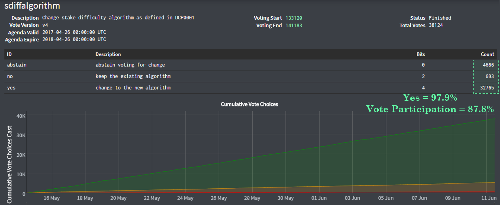
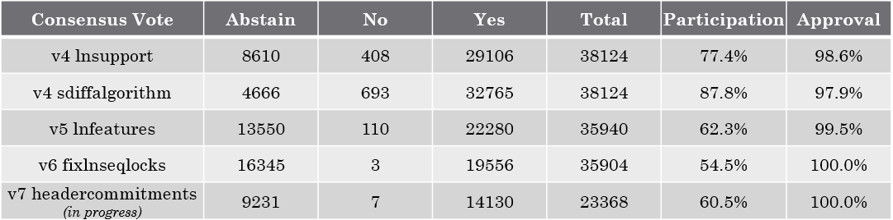
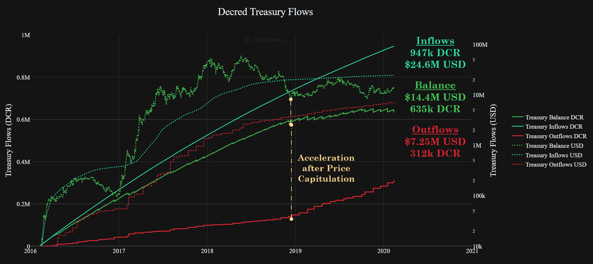
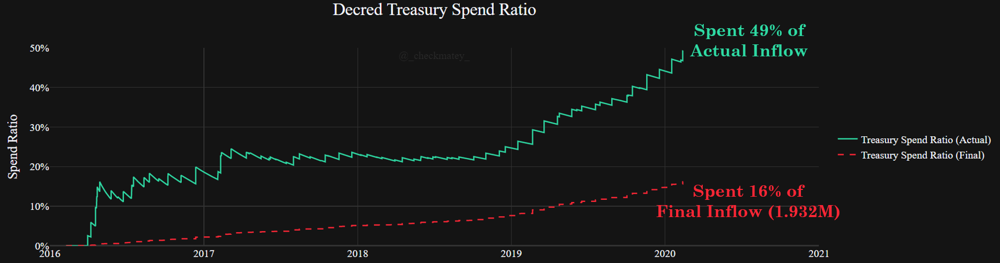
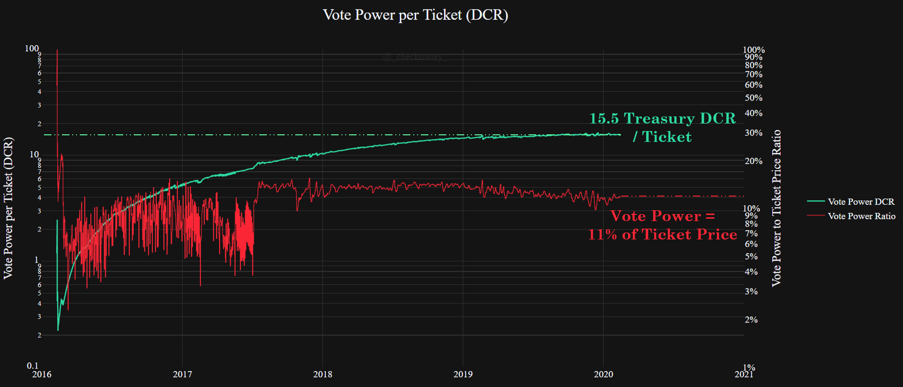
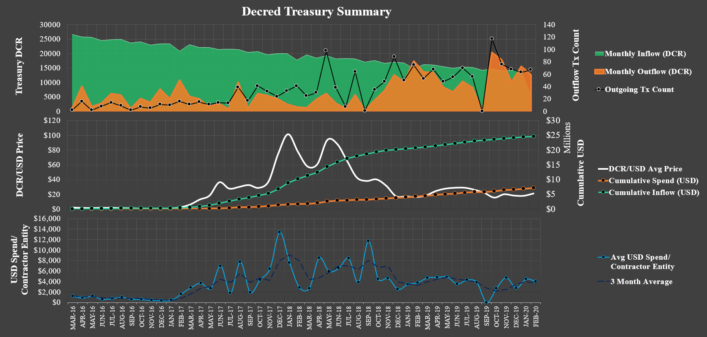
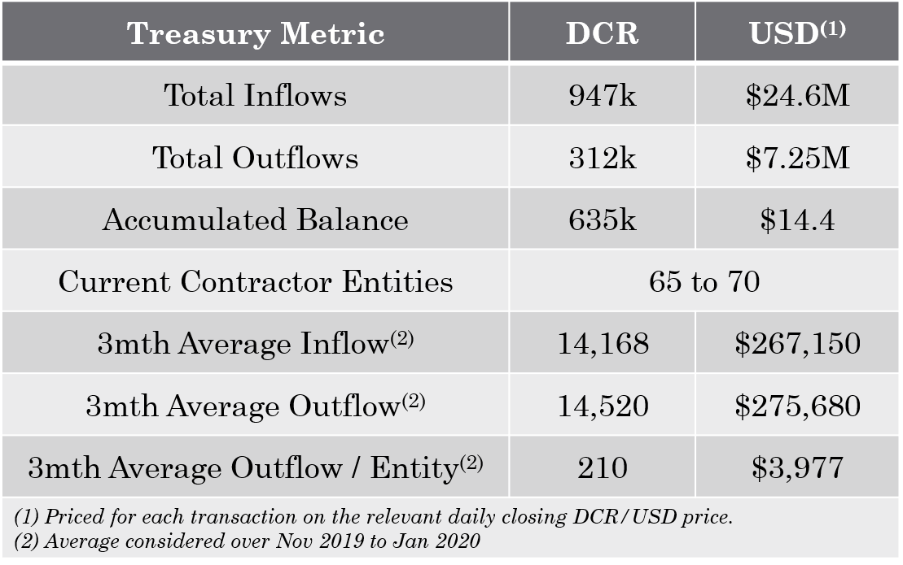

# Decred, The Resilient Stronghold
*by Checkmate*

*30-Jan-2020*

**Decred** is one of the most promising cryptocurrency projects and a sound competitor next to Bitcoin in the free market for scarce digital money. At a minimum, strong market competition forces innovation and hardening of the strongest protocols whilst also providing a rational hedge for risk during the nascent development of digital money.

The following article is the final part of a three-part study into Decred from a data-driven and first principles perspective. The series aims to critically compare the performance of both Decred and Bitcoin across the following value metrics:

1. [Monetary policy and Scarcity](https://medium.com/@_Checkmatey_/monetary-premiums-can-altcoins-compete-with-bitcoin-54c97a92c6d4)
2. [Cost of Security and Unforgeable Costliness](https://medium.com/@_Checkmatey_/decred-hypersecure-unforgeably-scarce-e076b91a2be)
3. Governance, User Adoption, and Resilience (this paper)

[*Background image courtesy of NASA*](https://www.nasa.gov/sites/default/files/styles/full_width_feature/public/thumbnails/image/iss052e007857.jpg)

# Overview

In this paper, I explore the aggregate **resilience, adoption and governance behaviour** of key participants in the Decred network. Decred's incentive structure is unique amongst cryptocurrency protocols, engaging the attention and action of four parties, each with a critical role in sustaining network health:

- **Users** who utilise DCR as an uncensorable and self-sovereign means for storing and transferring wealth.

- **Proof-of-Work Miners** who provide unforgeable ledger security and construction of the blockchain.

- **Proof-of-Stake Stakeholders** who provide checks and balances to PoW security and protocol governance decisions.

- **Proof-of-Skill and Time Builders** who develop, research and disseminate technology, knowledge and awareness to enhance the Decred value stack.

## Skin-in-the-Game

In many instances, individuals participating in the Decred network are active in more than one of these categories, in some cases all four. 

It is not uncommon for Miners, who have invested heavily in both CAPEX and OPEX to compete with ASIC hardware, to take an active interest in governance decisions to protect their investment. This also provides a passive, income stream for mined coins whilst HODLing, enabling unique revenue models.

The people who contribute to and develop the Decred codebase, market presence and research base, are typically strong hand holders of DCR and active participants in Proof-of-Stake security and governance. Having developed sound understanding of Decred fundamentals, these people are often motivated and dedicated DCR HODLers of last resort.

These examples are distillations of an essential yet informal value of Decred holders, skin-in-the-game. This paper studies this aggregate behaviour driven by individual skin-in-the-game for all four user categories. It aims to describe how the Decred blockchain has performed as a whole over time.

## TL; DR
- Growth metrics of **DCR Hodlers** has been relatively sluggish compared to Bitcoin at the same age and especially with respect to the strong ledger assurances provided by Decred. Decred has security finality guarantees orders of magnitude higher than it's current transactional throughput and has shown impressive resilience against re-organisations.

- **Miners** have likely experienced challenging financial conditions through 2018 to 2019 after ASICs launched at the peak of the bull market. Early signs of difficulty ribbon recovery and block subsidy models suggest strong fundamental support exists below current DCR pricing. It is expected that miners deploying additional or next generation ASIC technology will require a sustained increase to the DCR/USD price to justify the investment.

- **Stakeholders** have shown remarkable resilience throughout the 2018-19 bear market with over $5.6 Billion in value spent on DCR ticket purchases (1.0 Million BTC equivalent). The governance vote to change the stake difficulty algorithm was very clearly against the fee income interest of miners, yet passed with 97.9% approval. This suggests strong alignment between miner and user values and/or strong coin and thus vote decentralisation has occurred for Decred.

- **Treasury** spending to date has achieved a remarkable output of world-class technology relative to a modest $7.25 Million spend. The value of each DCR ticket relative to the Treasury balance (vote power) suggests strong incentives by stakeholders to protect the Treasury by personal sacrifice.

## Disclosure

*This paper was written and researched as part of the author's [research proposal](https://proposals.decred.org/proposals/78b50f218106f5de40f9bd7f604b048da168f2afbec32c8662722b70d62e4d36) accepted by the Decred DAO. Thus, the writer was paid in DCR for their billed time undertaking the research. Nevertheless, the study aims to be objective and mathematically rigorous based on publicly available market and blockchain data. All findings can be readily verified by readers in the attached [spreadsheet](X) and all assumptions shall be clearly stated.*

# UPDATE SPREADSHEET

# 1) The Immutable Wealth of DCR Holders

At it's core, Decred aims to provide an immutable, uncensorable and self-sovereign store of value in the DCR crypto-asset. Decred's hard-coded, supply cap and deterministic monetary policy make it a valid contender in the landscape of digital stores of value. 

With growing market size and increasing network decentralisation, Decred now boasts an impressive security system. This provides users with a set of unique [assurances for resistance against ledger tampering, block re-organisations and double spends](https://medium.com/@permabullnino/introduction-to-crypto-accounting-an-analysis-of-decred-as-an-accounting-system-4d3e67fce28). Decred's Hybrid PoW/PoS consensus mechanism thus acts to secure user wealth held in DCR, settle value transferred over the ledger and uphold these immutable characteristics.

## Resistance to Reorganisations

The Decred protocol is four years old and impressively, has experienced very few blockchain reogranisations through history. Re-organisations to a depth of one block are natural phenomena  in blockchains (including Bitcoin) as a result of network latency and probability and usually work themselves out. As of block height 414,977, the following [block re-orgs have been detected](https://matrix.to/#/!vGasNHFXqjoEWUBTIi:decred.org/$157910732378277MwoqT:decred.org?via=decred.org&via=matrix.org&via=zettaport.com) with the majority of depth 2 and all of depth 3 being associated with a [bug encountered during the DCP004 upgrade](https://matheusd.com/post/dcp0004-and-hardforks/):

- Depth 1 blocks = 1922 instances (0.4631%, natural phenomena).
- Depth 2 blocks = 25 (0.006%, most during DCP004 upgrade).
- Depth 3 blocks = 3 (0.0007%, all during DCP004 upgrade).
- Depth >3 blocks = Nil.

Thus, Decred's implementation of a hybrid PoW/PoS consensus mechanism has to date maintained consensus at the chain tip for 99.9933% of its four year lifespan, impressive for a network valued at $150M at the time of writing.

## Global Transaction Settlement

Decred has settled over $11.44Bil in USD denominated transaction value, via the transfer of 409 Million units of DCR. Of this, $5.55Bil (48%) can be attributed to stakeholders participating in the PoS Ticket system. Tickets represent an active participation mechanism for those holding DCR coins as an inflation hedge, store of value or speculative investment.

For context, Bitcoin at age 4yrs (first halving), had settled a total transaction value of $10.83Bil in USD value via the transfer of 1.17Bil BTC. 

It is worth highlighting some differences in market and coin holding behaviour between Bitcoin and Decred users to detail these observations. 
- Bitcoin pricing and first exchanges became reliably active in 2010-11 before which BTC had no market value. Decred launched into a 2016 market into almost immediate exchange listings to facilitate price discovery.
- For Bitcoin, coins held as a store of value or inflation hedge are often held in cold storage for months to years without transacting, leaving only the withdrawal transaction signature on-chain. Conversely, DCR held by long term holders is in constant on-chain circulation for participation in the PoS ticket system.
- Bitcoin has historically acted as the reserve asset for the cryptocurrency market which increases coin velocity.

Thus, it is reasonable to expect Bitcoin to have settled a higher number of coins (low early price) for a similar aggregate USD value. This data suggests that holding DCR as a long term speculative investment or store of value is the primary use case of DCR to date.

## Daily Transaction Settlement

The transaction value settled by Bitcoin and Decred on a daily basis are shown in the chart below, compared to the most adverse security budget curves developed in [Part 2 of this study](https://medium.com/@_Checkmatey_/decred-hypersecure-unforgeably-scarce-e076b91a2be). It can be seen that both protocols settle millions in USD denominated value, and orders of magnitude more than their respective security budgets. 

This suggests that both protocols display a strong **Settlement Premium** where the value settled exceeds the block reward available to incentivise honest security providers. It is likely this premium is representative of the secondary costs of acquiring hardware, hash-power and coordinating the logistics of an attack. Additionally, one must consider the scope of potential reward for an attacker such as censoring specific transactions, shorting the coin price for profit or system wide disruption (mining empty block etc).

For Decred, the $6.8M in value settled daily aligns approximately with the 15% ticket share security line. In other words, the cost to re-organise the Decred ledger in a double spend attack, assuming the attacker holds 15% of all tickets (at no cost), is approximately equal to the total value flowing through on the chain. Interestingly, this aligns with a typical ticket share of the [largest stake-pool](https://decred.org/vsp/). However, this likely consequential rather than a driving factor as this attack vector requires approximately 40x the honest hash-power to conduct and is thus unlikely.

The Decred 50% ticket security curve (light red) can be considered as an equivalent pure PoW security metric as an attacker with 50% of tickets still requires a 51% attack on miners. It can be seen that the **Settlement Premium** is similar in magnitude to 4year old Bitcoin through comparing y-axis values of security curves to daily settled value.

## User Activity 
Where a notable difference between user behaviour can be observed is via monitoring transaction counts as a proxy for network activity. 

Bitcoin has seen a consistent growth in meaningful transaction counts over time. Transaction counts generally follow/lead movements in price and align with Bitcoin's continued market dominance and position as a local reserve asset for the market.

For Decred, it can be seen that transaction counts have been comparatively higher in the early years however have remained consistent and range-bound throughout its lifetime. This indicates sluggish growth in new users and this trend can be observed across similar activity metrics like active addresses. Decred activity metrics also followed price during the 2016-17 bull market however with a notably weaker correlation strength to Bitcoin.

A consistent baseline of DCR ticket activity makes up around 62% of the cumulative transaction count. This chart shows the aggregate for the three separate transactions through the ticket life cycle: 1) UTXO aggregation 2) ticket purchase transaction and 3) vote transaction.

Since August 2019, the Decred on-chain privacy mixing protocol has been operational and was followed by an uptick in both transaction counts and active addresses. This is a result of both demand for privacy mixing as well as technical factors whereby mixes utilise more transactions and addresses during execution.

Comparing the count of daily active addresses for both ledgers shows Decred address activity to be around 45% to 50% of that seen for Bitcoin following launch of the privacy implementation. Prior to privacy mixing, Decred was at a low of 25% relative activity.

## Native Units Moving On-chain

Reviewing the daily mean and median transaction sizes, we can establish a macro view into user behaviour on-chain, and how it has evolved over time. 

Bitcoin's trend shows a gradually reducing mean and median transaction size. This is indicative of the increased economic value supported by the chain following price appreciation through bull-bear cycles. Decred has experienced only once such market cycle (2016-2020). Interestingly, Decred shows a similar magnitude of both mean and median transaction size compared to Bitcoin at the same age.

Decred tickets have experienced a near-linear uptrend in DCR denominated price as more coins enter circulation through the block subsidy. Given an average daily flow of 4,425 ticket related transactions, the ticket price (white) enacts an upwards gravity on both the mean and median transaction sizes.

Mean DCR transaction size has generally followed this ticket price trend closely. Prior to privacy mixing, a mean transaction size of around 80DCR represented 62% of the then ticket price (130DCR), consistent with the cumulative transaction counts metric. Following privacy mixing, an increased volume of smaller sized transactions lead to a decrease in both mean and median size.

The median DCR transaction size has shown an inverse correlation to coin price, a similar trend observed through Bitcoin's history. As the USD value of coins increase, an equivalent denomination of USD value can be stored or transferred in a smaller volume of coins. It is also indicative of increased usage by smaller, retail level users purchasing coins during bullish markets and peaks in market attention. The inverse is also true where bear market users are dominated by larger, long term holders with higher conviction.

## DCR Hodler Summary

Overall, Decred aggregate transactions volume and size suggest comparable economic value flowing through the Decred chain as Bitcoin circa 2013, albeit in fewer, larger sized transactions. Ticket related activity accounts for approximately 50% to 60% of on-chain flows and supports the notion that most users treat DCR as a long term speculative investment or store of value candidate.

Decred has an approximately equal network valuation to Bitcoin at the same age whilst supporting approximately 25% of the daily transaction and active address count (privacy mixing excluded). Along with range-bound transaction counts, this highlights a slower growth and uptake of Decred as well as Bitcoin's dominance as a local reserve asset for the cryptocurrency market. The new CoinJoin implementation clearly indicates strong demand for DCR fungibility and Decred block-space, a promising development. 

# 2) The Unforgeable Work of DCR Miners

Proof-of-Work miners are integral to the security, decentralisation and immutability of the Decred blockchain. Miners are responsible for building the blockchain by cryptographically hashing valid transactions into blocks, and presenting them for validation by PoS tickets.

Miners invest in mining hardware and establish long term energy contracts to provide this service which secures the blockchain through a number of unavoidable mechanisms:

- Investment in Application Specific Integrated Circuits (ASIC) create an incentive for honest miners to defend their sunk-cost CAPEX. This aligns miner incentives with the users and success of the Decred blockchain.
- Creates a financial and logistical hurdle for potential attackers to overcome in order to acquire sufficient hash-rate and energy resources to build an competitive side-chain.
- Proof-of-Work consensus roots the cost of block creation to an unforgeable demand for energy.
- The globally competitive market for energy leads to widely distributed mining operations in pursuit of favorable combinations of energy sources and contracts, hardware manufacturing, climates and regulatory jurisdictions. This promotes geographical distribution of mining operations to provide system redundancy and resilience.

## Growth of Hash-rate

Decred launched into the 2016 market where GPU miners were readily available, and thus had an initial difficulty set to the equivalent hashpower of 256 contemporary GPUs. Decred mining has since progressed to become an ASIC dominated chain with ASICs coming online in early 2018 [[1](https://youtu.be/7K2sDhyjQys)], [[2](https://youtu.be/8TPFIVYy_i4)]. Following ASICs, the Decred hash-rate has expanded by 1,000x with most growth occuring over a one year period from 2018 to 2019.

The Decred hash-rate currently fluctuates between 400-500 PetaHash/s, a similar magnitude to  Bitcoin circa 2015, after the introduction of ASICs in 2012. Decred hash-rate has remained relatively stable since early 2019 in response to depression of the DCR/USD price during the bear market cycle. There are remarkable similarities in the growth rate of Decred hash-power from age 0 to 4yrs compared to Bitcoin from age 3 to 6yrs.

The Decred difficulty ribbon is presented in the chart above by taking a series of daily moving averages (9, 14, 25, 40, 60, 90, 128 and 200 periods) of protocol mining difficulty. The difficulty ribbon provides insight into the aggregate behaviour of miners and shows Decred has experienced four distinct phases of the mining cycle, summarised in the table below.

What is notable is the coupling between Bitcoin price and hash-rate trends. Re-expansion of the Bitcoin difficulty ribbon tends to follow price appreciation during bull markets and, conversely, compresses following the capitulation phase at the end of bear markets.  

For Decred, ASICs were introduced to the network at the peak of what became a significant and industry wide bear market, starting early 2018. Thus Decred has experienced a process of hash-rate expansion due to improved hardware efficiency (superseding GPUs) without the support of coin price appreciation.

As such, it is likely that the present cohort of ASIC miners have endured challenging financial conditions, particularly through 2019. This is confirmed by the current compression of the Difficulty ribbon, a result of miners turning off unprofitable hardware.

Similarly, it is reasonable to conclude that miners will require sustained DCR price appreciation to justify any further investment in hardware CAPEX or upgrades. Therefore, the author expects the Decred hash-rate and mining difficulty to remain range-bound at current levels until this price upper threshold is passed.

## Miner Income

We can establish a basis for aggregate miner behaviour by reviewing the [cumulative block rewards](https://medium.com/@permabullnino/decred-on-chain-a-look-at-block-subsidies-6f5180932c9b) paid to miners (incl. subsidy and fees). It is important to remember that miners carry costs denominated in local fiat currencies for hardware, overheads, capital costs and energy contracts. Thus, the USD price is the correct metric as a baseline for assessing miner incentives. In this context, Decred has paid miners over $147M in PoW rewards with $875k of this attributed to transaction fees (0.595%).

Long term development of a fee market is a critical evolution to sustain a fixed maximum coin supply of 21M units. The ratio of daily transaction fees as a proportion of the total block reward shows Decred fees currently account for 0.04% of miner income. Similar to block-space utility, the Decred privacy implementation has shown to be a positive feature for miner incomes and the fee ratio as demand for mixing increases the volume of fees paid.

### The Stake-Diff Algorithm

Of note is the distinct plateau in cumulative transaction fees paid after July 2017. This is a direct result of the consensus rule change to [replace the original stake-difficulty algorithm](https://medium.com/decred/new-stake-difficulty-algorithm-cdf432d623fe) which had a natural resonance in the ticket price. This led to 'fee wars' were users attempted to acquire tickets during price troughs and resulted in an overall poor user experience. This consensus rule change [passed a governance vote with 97.9% approval](https://explorer.dcrdata.org/agenda/sdiffalgorithm) despite being clearly against miner short term interest (higher fees).

There are two mechanisms that would lead to this vote result, both of which the author deems very positive outcomes for the Decred project health and credit to the governance and upgrade system:

1. Miners are freely able to stake mined coins, and during the 2017 bull market, this was a profitable strategy. Thus miners holding tickets still voted in favor of long term user experience rather than in their own short term financial interest. This suggests sound alignment of miner values with those of the rest of the community.

2. Mining was dominated by dual Ethereum GPU miners in 2017, whom are generally believed to have distributed DCR coins almost immediately to exchanges for sale. Thus, miners would not have had a a significant say in the vote and this indicates a wide, public coin distribution has occurred which enhances vote decentralisation.

An additional observation pertaining to cumulative miner rewards paid is the notion of miners 'putting the bottom in' for bear markets. Given this represents the aggregate income of the mining industry, when the network valuation falls below this level, it can indicate mining is becoming increasingly unprofitable on aggregate.

This leads to weaker miners disabling mining rigs, a compression of the difficulty ribbon and an increased share of hash-rate gained by stronger miners. Given strong miner strategy tends to focus on accumulation of coins in bullish markets, this begins to constrain the available supply entering the market and has historically shown to precede price appreciation and bullish conditions, both for Bitcoin and Decred.

## Summary of Proof-of-Work Miners

Decred mining is dominated by ASIC hardware and has experienced significant growth in hash-rate despite bear market conditions since 2018. It is likely that miners have been tested by challenging financial conditions and poor profitability since 2019 which sheds some light on the mechanisms behind DCR price performance, particularly through 2019 and early 2020.

That said, the difficulty ribbon and cumulative rewards paid to miners are exhibiting typical basing patterns often seen in other proof-of-work coins like Bitcoin. A notable increase in demand for block-space is seen following the launch of Decred's privacy mixing technology which carries a net positive impact on the fee ratio and long term sustainability of the DCR mining market. 

# 3) The Strong Hands of DCR Stakeholders

Long-term holding of DCR is distinctly different to many other crypto-currencies in that it promotes the continual movement of coins in the form of PoS tickets. The purchase of a ticket ([or part thereof](https://docs.decred.org/proof-of-stake/ticket-splitting/)) is an explicit and deliberate act to bind a volume of DCR coins, in an illiquid state, to the performance of the Decred network.

[Tickets undergo a process](https://docs.decred.org/proof-of-stake/overview/) of maturation, pseudo-random selection to vote and then another maturation delay before coins are released. The whole process can take anywhere between 1.5 and 142days and ticket stakeholders are thus exposed to coin price volatility, and market reaction to any consensus or governance votes during that window.

As reward for their patience, resilience and acceptance of price risk, stakeholders are rewarded with 30% of the block reward, split equally between the five tickets selected to vote on each block. This process gamifies participation in Decred governance whilst also promoting a desire to 'choose wisely' for governance and consensus decisions.

### Ticket Participation

The cumulative DCR bound to the chain in tickets (blue) has very closely matched the total coin issuance via Proof-of-Work (red). This is an important observation, it suggests DCR coins distributed by miners (who are compulsory sellers) are ultimately making their way back into the PoS system after being accumulated by investors, improving wealth distribution and vote decentralisation.

The chart below shows that in the lead up to, and during a protocol consensus change vote, DCR bound to the chain grows noticeably. This indicates a strong incentive for participation and a demand for stakeholders to have a meaningful say.

## Hodler Psychology

DCR holders are free to opt-out and sell their coins into the market at any time when coins are not bound in tickets. Thus, all ticket purchases carry an underlying assumption, that the individual believes the ticket price plus PoS block reward will be more valuable in the future than today.

In other words, if a holder believes obtaining the PoS block reward is not worth the volatility risk, they are better off holding liquid DCR coins or to move to sell them, rather than take on risk for a pseudo-random period of time.

This is a very different mechanism to Bitcoin holders who will typically send BTC coins they believe are undervalued into deep cold storage. The team at [Coinmetrics developed the Realised Price](https://coinmetrics.io/realized-capitalization/) to quantify this behaviour by measuring the value of each UTXO, priced at the time it last moved. It thus represents an aggregate view on the market cost-basis for BTC coins, and a lower bound on what long-term holders believe the Bitcoin network is worth (the value users have 'saved' in BTC).

For Decred, the realised price is more closely correlated with market value as it is influenced by the continual flow of DCR in tickets. Thus, this metric does not adhere to the same set of assumptions and instead has shown to be a point of market support and resistance in bull and bear markets respectively.

## Stakeholder Commitment

Rational market actors are more likely to sell DCR they believe is overvalued, rather than buy tickets and take on volatility risk. By taking a cumulative sum of all DCR bound in tickets, priced at the time of purchase, we can establish a measure of stakeholder 'commitment' to the Decred chain. This represents the aggregate dollar value locked in tickets.

To date, Decred stakeholders have committed over $5.6 Billion in value to the chain in ticket purchases, approximately 38x the market cap of the entire network at the time of writing. Price in BTC, this equates to 1M BTC in value purchased in tickets, two orders of magnitude greater than network value and cumulative rewards paid denominated in BTC.

Interestingly, these psychological stakeholder commitment lines have acted as points of price resistance during the 2017 bull trend. For ticket holders, selling DCR at prices that exceed the aggregate 

Conversely, PoW miners, who's cost basis is USD denominated, cannot be expected to commit more hash-power investment than is allowed for in the USD denominated block reward. The cumulative miner USD income line has thus shown to be a level of fundamental support during bearish trends.

Investors in the cryptocurrency market often consider their cost basis denominated in BTC, being akin to the local reserve asset of the market. It thus makes sense for investors, who participate in the PoS system, to develop psychological price levels with respect to the DCR/BTC pair.

When modelling the cumulative rewards paid out to both PoW miners and PoS stakeholders, it can be seen that both fundamental levels are respected by the DCR/BTC price chart [(credit to @permabullnino for this finding)](https://medium.com/@permabullnino/decred-on-chain-a-look-at-block-subsidies-6f5180932c9b). In total, stakeholders have locked over $1.0M in BTC denominated value in tickets, two orders of magnitude more that the cumulative block reward issued to both PoW miners (31.4k BTC) and PoS stakeholders (15.3k BTC).

## Stakeholder Summary
Stakeholders are central to the unique security and governance mechanism of the Decred blockchain. There is early evidence of psychological levels being associated with stakeholder incentives and sentiment with network valuations respecting cumulative block reward and ticket lock-up lines.

There is a clear correlation between ticket prices and the PoW issuance curve, especially through the early 'great inflation'. Coupled with clear increases in DCR locked tickets around consensus changes, strong participation rates (>50%) and the user favorable change to the stake-difficulty algorithm, it suggests that Decred has a strong coin and thus vote distribution within the market. This is a positive observation pertaining to stakeholder decentralisation and network resilience.

# 4) The Skill and Time of DCR Architects

At the core of Decred's centre of gravity is the Decred Treasury which is fueled by 10% of the block-subsidy. The Treasury is available for active deployment by the hive-mind of ticket holders for the purpose of enhancing Decred protocol value.

This mechanism carries a number of notable advantages for Decred, especially in the long term:

1. **Maximises the protocol's self-sovereignty** by minimising the influence of external parties on project direction. Many cryptocurrencies have resorted to funding mechanisms such as venture capital raises, initial coin offerings and reliance on donations. All such models have constraints such as ulterior motives of financial backers, compliance with securities laws, and slowness of progress (on a donation model).

2. **Incentivises sustained engagement by skilled people** who meaningfully contribute to the project. This grows the pool of dedicated DCR holders and enhances resilience of the governance model as these builders are personally motivated to see the protocol succeed.

3. **Builds resilience and reliability in the development progress** where responsible management of treasury funds during 'good times' can subsequently act as a back-up reserve during downturns to ensure continued progress.

4. **Creates opportunity for perfectly equitable employment** whereby individuals in a decentralised and global context can trade their time and skill for DCR coins, all free from background checks, discrimination or compromising personal privacy.

## Self-Sovereign Bootstraps

The Decred decentralised organisation has bootstrapped itself from genesis in a completely self-sovereign manner, without a single fund-raise from external parties. Decred development relies solely on the markets pricing of DCR and thus the value of DCR accumulated in the Treasury. Thus there is a distinct relation between Treasury spending, the quality of output products and the future and longevity of both Decred and the Treasury.

In addition to developing the Decred blockchain itself, the Treasury has supported the delivery of a suite of world class open-source technologies:

- [dcrtime](https://blog.decred.org/2017/06/14/dcrtime-Blockchain-based-Timestamps/) which facilitates immutable time-stamping of data into the Decred blockchain and [new possibilities for representations of truth in a digital world.](https://medium.com/decred/building-a-transparent-future-with-the-decred-blockchain-e77471d28059)
- [Politeia proposal and governance system](https://blog.decred.org/2018/10/15/Politeia-in-Production/) which powers decentralised coordination, discussion and governance of a global pool of stakeholders.
- [On-chain atomic swaps](https://blog.decred.org/2017/09/20/On-Chain-Atomic-Swaps/) and [a decentralised exchange](https://blog.decred.org/2018/06/05/A-New-Kind-of-DEX/) facilitating trustless asset exchange between Decred and other cryptocurrencies like Bitcoin and Litecoin.
- [Privacy preserving CoinJoin system](https://blog.decred.org/2019/08/28/Iterating-Privacy/) providing optional obfuscation of user UTXO transaction history on the Decred blockchain.
- [Decred specific implementation of the Lightning Network](https://blog.decred.org/2019/11/11/LN-Multi-Owner-Tickets/) enabling a trustless and scalable payments network to be built on top of the Decred blockchain.

At the time of writing, and with all transactions priced at the time of occurrence, the Treasury has:
- Received 947k DCR, equivalent to $24.6M USD.
- Spent 312k DCR, equivalent to $7.25M USD ($7.66M if considering the 4% founders pre-mine as an expense priced at $0.49/DCR).
- Accumulated a balance of over 635k DCR, equivalent to $14.4M USD.
- A spend ratio of 49% of actual DCR inflows to date, equivalent to 16% of the final 1.932M DCR inflow.

In the context of a market with high profile cryptocurrencies raising hundreds of millions, to billions of dollars in ICO sales, often before a blockchain product was developed or deployed, this is remarkable output for a $7.25M spend.

## Stakeholder Vote Power

DCR stakeholders can be expected to act in their financial best interest, aiming to preserve and enhance the fundamental and market perception of DCR coins. Given the pseudo-random time of lockup for DCR in tickets, the impact of vote decisions for Treasury spend will be felt by stakeholders. This incentivises intelligent and thoughtful discussion and decision making as well as participation in the governance process.

This system is akin to miners protecting their ASIC investment, where stakeholders act to protect both their own DCR value and the value of the Treasury itself. Longevity of the Treasury is a key component to the Decred value proposition and thus, it is in stakeholders best interest to protect it.

To illustrate this point, [Naseer (2019)](https://medium.com/@Ammarooni/decred-an-alternative-contender-a3547a014745) analysed the potential value that could have accrued for Bitcoin had it implemented a Decred like Treasury system:

> How much cash could Bitcoin have had, if Bitcoin had Decred’s design and a Treasury Fund? Up to $18 Billion.

Every DCR ticket in the pool has equal opportunity to contribute vote power towards Treasury funding decisions. Given each ticket has a price denominated in DCR, one can establish a measure of the amount of financial power each ticket wields from the Treasury. Shown in the chart below:

- Blue: Taking a ratio of the Treasury DCR balance to the number of tickets in the pool, each ticket currently carries a decision weight of 15.5 DCR. As the ticket pool oscillates around the target of 40,960 tickets, it can be seen this metric is plateauing over time, indicating Treasury spend is reaching parity with inflow.

- Red: Taking a ratio of the above value to the DCR ticket price shows that each ticket has historically carried a vote power of between 8% and 12% of the ticket value. This is an interesting metric as it shows stakeholders actively sacrifice personal coin liquidity to protect and participate in Treasury funding decisions, with votes representing only a fraction of the value locked up.

## Decred, the Fair and Equitable Employer

The Treasury is an invaluable differentiator for Decred. It creates an open, fair and equitable way for individuals to deploy and acquire DCR coins by leveraging the whole range of human skills and capabilities. 

Protocols secured by a pure PoW consensus rely on users acquiring coins via technically challenging and often expensive mining operations or by purchasing coins off the market. Pure PoS consensus blockchains often struggle to find a fair balance between a fair initial distribution, sustainable funding and avoiding perpetual wealth concentrations.

For Decred, the Treasury creates an entirely new and unique opportunity for coin acquisition. People from all backgrounds, nationalities and socio-economic positions can propose, deliver and contribute their skill and time to the project, and be paid for their efforts. This is a mode of employment requiring no reference checks, no background checks and fully supports pseudo-anonymity and personal privacy. One merely needs to build trust with current stakeholders by active development and delivery of services deemed valuable to the project. 

In fact, the author of this paper has never revealed their identity nor provided any personal information. Instead, the author opts for pseudo-anonymity and an approach of building trust via consistent delivery of work as detailed in phased proposals.

This is a remarkable shift in the concept of employment.

Aggregate analysis of the Decred Treasury address shows that on a monthly basis, approximately 65 to 70 outgoing transactions are paid providing an estimate on the number of contractor entities who bill the Treasury each month. An average of 210 DCR and $3,977 is paid out per contractor entity, noting some entities will be corporate contractors consisting of multiple individuals.

An important note for stakeholders is that on a 3mth average basis since November 2019, the monthly Treasury outflows ($275,680) are exceeding inflows ($267,150) by approximately $8,530 per month. This means that the accumulated DCR balance is being consumed for DCR priced at an average of $18.80. 

## Summary of the Decred Treasury

The Decred Treasury is an invaluable cornerstone of the Decred project's success and longevity. It enables a fully self-sovereign development cycle and is nothing short of a remarkable experiment in distributed human organisation and employment.

The Treasury has spent a very modest $7.25 Million with an extraordinary volume of world-class technology and products to show for it. Until very recently, the Treasury has operated at a surplus with outflows only outpacing inflows through a period of heavily depressed prices in late 2019.

# Conclusion

