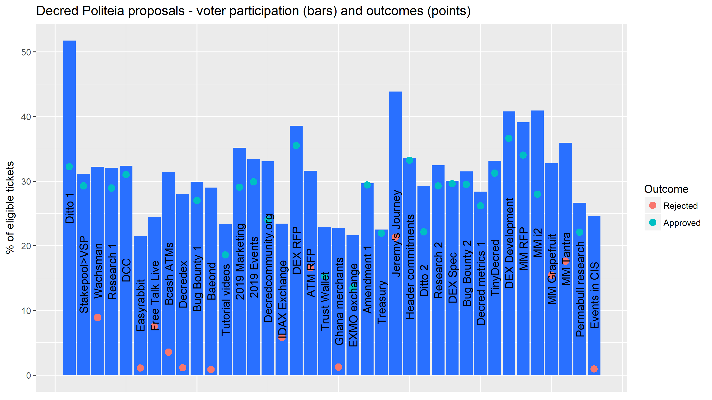
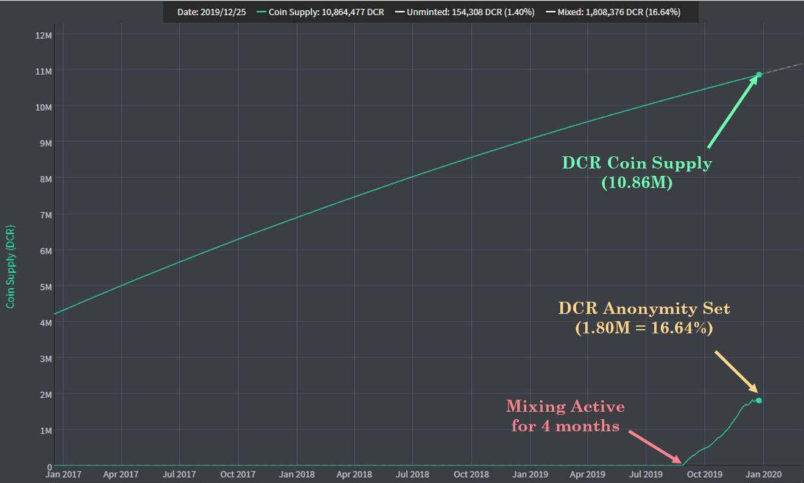

# Our Network - Week 1
https://ournetwork.substack.com/p/our-network-issue-2

## Insight 1 - The Decred Security Curve
Decred is secured by a unique Hybrid PoW/PoS consensus mechanism. Each block must be PoW mined, followed by validation by 3 out of 5 pseudo-random PoS tickets. If validation fails, blocks must be re-mined, forfeiting PoW expenditure  and the block reward. The chart below presents the relative magnitude of honest hash-power to successfully double spend DCR for a given share of the ticket pool (Y-axis value of 1.0 equates to a standard 51% attack with added cost of holding 50% of tickets).

## Insight 2 - Block Subsidy Models
The Decred block reward is split 60/30/10 to PoW/PoS/Treasury. Considered with the hybrid consensus mechanism, Decred functions as a high assurance, triple entry accounting ledger. @PermabullNino released a paper studying these cumulative 'cash flows' revealing strong trend support for the DCR/BTC Price and the investor PoS break-even point (purple).

## Insight 3 - Miner Squeeze
Similarly, block subsidy models priced in USD are more representative of Miner behaviour as Decred is an ASIC dominated chain. The PoW subsidy line (red) thus indicates when miner profitability is being tested. This was recently confirmed by a squeeze in the difficulty ribbon followed by a 100% price bounce.

## Insight 4 - A Year of Politeia

Politeia marked a year of use in October, with 38 proposals put to a vote, 25 approved and 13 rejected. 13 of the 25 approved proposals had overwhelming (90%+) stakeholder support. Average participation rate of eligible tickets was 31.2%, the highest voter turnout was 52% and the lowest was 21% (just above the 20% quorum requirement). 

## Insight 5 - Privacy Mixing Performance
Decred rolled out the first phase of its privacy implementation based on CoinShuffle++ and integrated with the PoS ticket system. This capitalises on a constantly rotating and pseudo-random supply of DCR. In the four months since launch, over 16% of the DCR supply (1.8M) has participated in mixing creating a large anonymity set.

