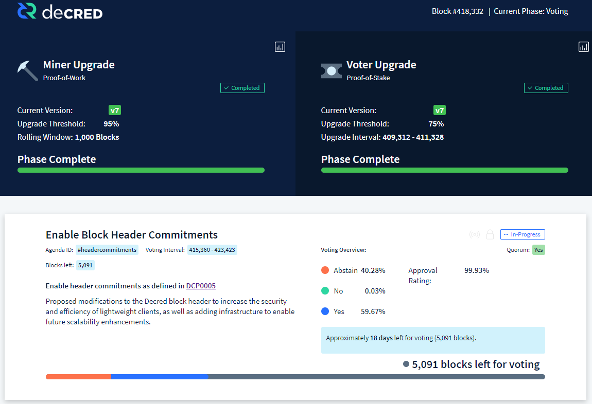

# Our Network - Week 2

## Insight 1 - Total Value Settled
Decred is approaching it's fourth Birthday on 8-Feb-2020 and to celebrate, this week will be covering a an array of achievements of the Decred chain to date.

Decred has finalised over $11.44Billion in USD denominated value over its lifetime, accounting for the movement of over 409Million DCR units. A dominant component of these on-chain flows comes from DCR tickets (~50%), which represent long-term holders participating in PoS security and governance. 

## Insight 2 - Growth of Decred Mining
ASIC hardware was first released for Decred in Janurary 2018, approximately two years after launch and at the peak of the 2017-18 bull run. Decred hashrate has grown by 1,000x following ASICs coming online. Given the prolonged bear market, the Difficulty ribbon is currently squeezed although showing early signs of recovery.

Interestingly, the acceleration in hash-rate growth and subsequent squeeze/plateau of the difficulty ribbon are reminiscent of Bitcoin throughout the the 2015 bear market.

## Insight 3 - Stakeholder Commitments
Decred is unique in that it supports both Miners and Stakeholders with coins continually circulating via DCR Tickets. Observing the aggregate behaviour of both parties shows each create fundamental support/resistance levels during price discovery.

- A cumulative $5.6B has been locked in DCR tickets and this commitment line (green) has been a magnet for price in a Bull Market. 
- The cumulative reward paid to PoW miners (incl. fees) now totals $147M and supports the notion that miners support bottoms for Bear Markets.
- The Realised Price acts as a dynamic support and resistance line in response to changing ticket flows in Bull/Bear conditions.

## Insight 4 - Treasury Expendature
The Decred treasury is a central component of Decred's value proposition, enabling sustainable and self-sovereign development into the future. The treasury recieves 10% of the DCR block subsidy for deployment by DCR stakeholders.

To date, the Decred treasury has accumulated over 639,600 DCR, equivalent to $11.5M at $18/DCR. This represents a spend ratio of 32% of inflows to-date and 14% of the final inflow of 2.1M DCR at the end of the block subsidy. Pricing all treasury expendature outflows on the day of the transaction, the Decred treasury has spent $6.96M USD bringing the protocol from genesis to its current form.

## Insight 5 - Decred Consensus Change DCP0005
Decred is currently undergoing its fifth on-chain vote to upgrade the consensus rules. The DCP0005 change restructures block headers and filters to improve SPV security and optimise the interaction between PoS votes and PoW miners.

The DCP0005 codebase lies dormant in the new node software. Only after 95% of Miners and 75% of Stakers upgrade does the vote to activate it go live. A minimum quorum of 20% of Stakeholders must vote with 75% consensus to activate the new code. The current approval rate has 99.94% of tickets voting Yes out of a 59.68% participation rate (note that abstain is default and only yes/no votes count as participation).

