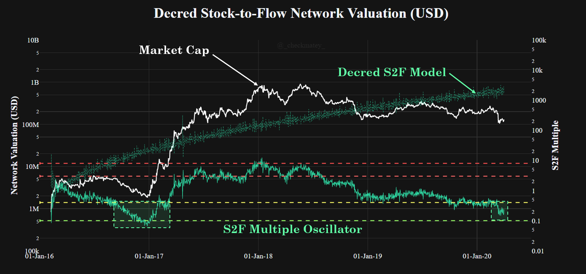
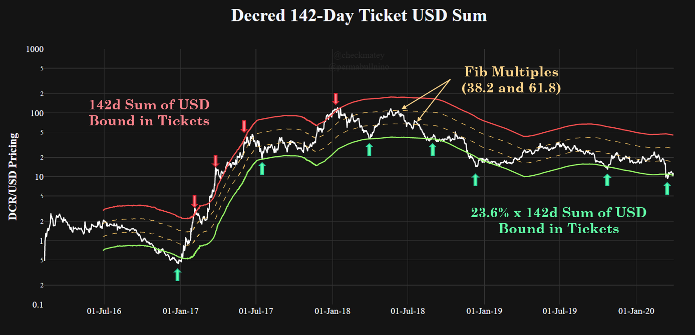
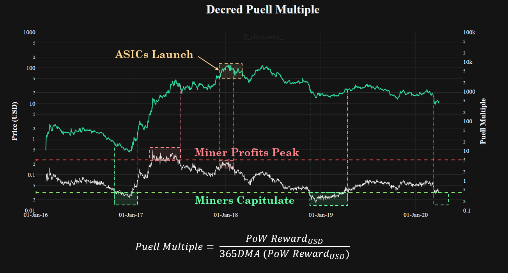
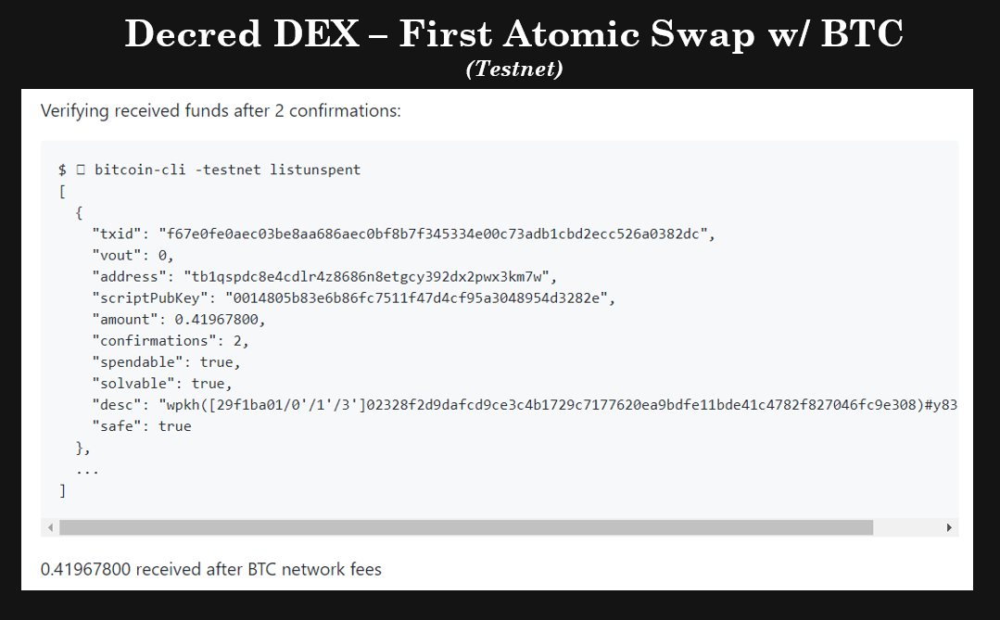

# Our Network - Week 4
https://ournetwork.substack.com/p/our-network-issue-15

## Insight 1 - Stock to Flow Model

The past month of price action in the cryptocurrency markets has been extreme, with Decred price action being no exception. This week we look at a number of key metrics which have reached extreme values, often associated with the formation of price bottoms, reflexivity, and mean reversion.

The first metric is the Stock-to-Flow model which was developed by the author. This model considers a log-log regression fit between Market Cap and the Stock-to-flow ratio of the Decred coin supply. The S2F Multiple is also shown which functions as an oscillator, indicating when network valuation has become over/undervalued relative to the S2F 'fair value' model. Following the price drop on 12/Mar, the DCR S2F multiple has entered the historical low zone last seen in Jan 2017.

## Insight 2 - Stock-to-Flow Residuals

The next chart shows the statistical distance between the Decred Market Cap and the predicted S2F model valuation, measured in standard deviations. For reference, an equivalent S2F model for Bitcoin is shown, with some interesting similarities in the fractals playing out in Decred's price discovery.

It can be seen for both networks, that as network value approaches ~2x standard deviations from the prediction, price tends to snap back towards the mean. For Bitcoin, this generally coincides with halving events, a shock to S2F value and scarcity. For Decred, this is more closely associated with oversold conditions since the smooth issuance curve is less variable than Bitcoin's.

## Insight 3 - 142-day Ticket Sum

An on-chain metric developed by @permabullnino is the 142-day sum of all USD value bound in Decred tickets. DCR coins bound in tickets are indicative of strong demand for holding DCR long term. This metric (red line) has shown to act similar to an upper bound Bollinger Band as resistance during price discovery.

By taking Fibonacci multiples (23.6%, 38.2% and 61.8%) of the 142-day ticket sum, additional trading ranges and boundaries have been identified. In particular, the 23.6% Fibonacci multiple (green line) has provided lower bound support throughout bull and bear cycles. In the 12/Mar market sell-off, price pierced below this level before rapidly bouncing back into the range.

## Insight 4 - Puell Multiple

Decred ASIC miners have endured very challenging market conditions after ASIC hardware was first released in Jan 2018, at the peak of the alt-coin market cycle. Given miners are long term thinkers and investors, the Puell Multiple provides insight into whether income streams are profitable or not and the level of stress in the hash-power network.

The Puell Multiple takes the ratio of daily PoW USD income to its 365day average. This provides a view of today's income relative to the past year. Similar to the metrics shown above, the Puell Multiple is approaching an extreme value commonly associated with the proverbial event where 'miners put the bottom in'.

## Insight 5 - Decred DEX First Atomic Swap

The Decred DEX is currently under development and is aiming to provide trustless exchange between crypto-assets via atomic swap technology. On Wednesday this week, Decred DEX server client successfully coordinated its first trustless exchange between DCR and BTC on test net. 

The DEX swapped 42 DCR for 0.42 BTC with an output from bitcoin-core testnet below showing successful receipt of the coins. Full transaction details of the atomic swap are found here for those interested in the inner workings (https://gist.github.com/chappjc/6c5bc6d9244e02249b867e8fe76e4762).

