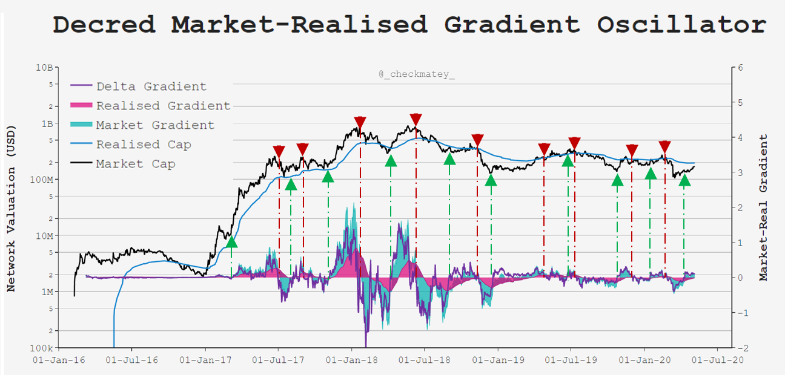
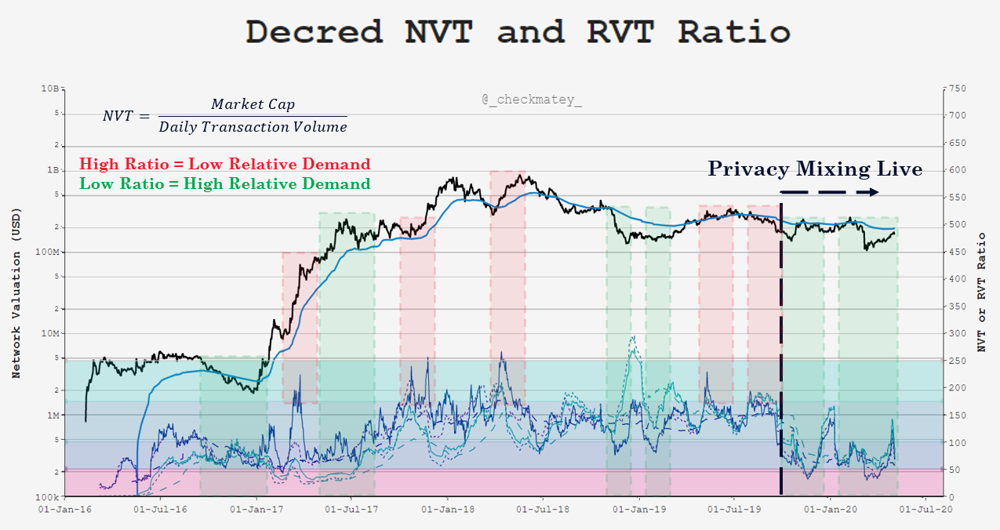
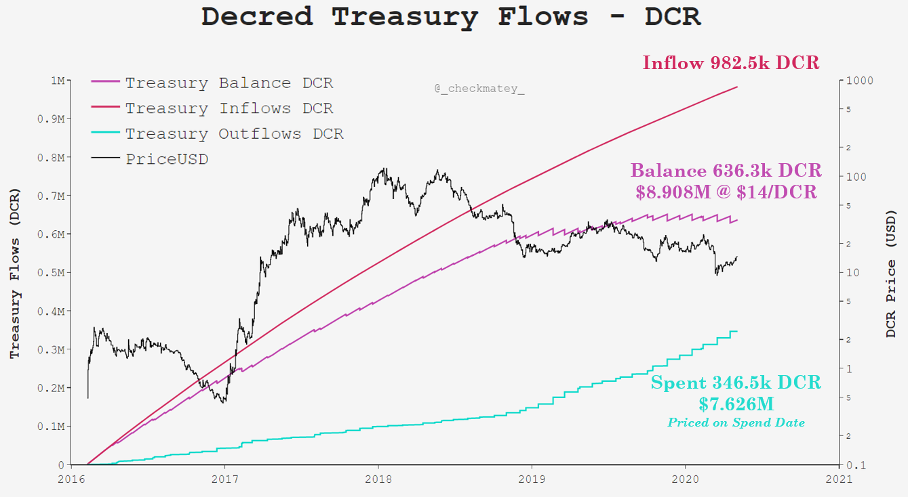

# Our Network - Week 5

## Insight 1 - Marrket-Realised Gradient

The Decred is a blockchain has a consistent baseload of demand for block-space, a result of the PoS ticket system and, more recently, on-chain CoinJoin privacy transactions. As such, the Realised Price metric differs in interpretation to Bitcoin. A strong conviction Decred holder actually has a regular and frequent on-chain signature moving DCR as opposed to the equivalent of long periods of dormancy for Bitcoin.

The Realised Price tends to follow the spot price more closely, however lags behind the day-to-day fluctuations in off-chain price sentiment. The chart below presents an experimental metric that takes the 28-day gradient of the Market Cap and Realised Cap, and produces an oscillator from their difference (purple). This tool distills times where off-chain price momentum bias flips before the on-chain response as DCR is bound in tickets and takes time to transact. Where the oscillator crosses the zero level, it often precedes a shift in price momentum in the direction of the flip.

## Insight 2 - NVT and RVT Ratio

As noted, Decred has a consistent transaction demand which also shows up as reliable NVT and RVT signals. These metrics take the ratio between network valuation (market cap or realised cap) and the adjusted daily transaction value flowing through the chain, all denominated in USD. The chart below presents the NVT and RVT both in 28-day and 90-day moving average format with sound agreement in trend and magnitude between all.

During periods of bullish sentiment, we can observe low NVT|RVT ratios indicating that the chain is settling a substantial value relative to its network valuation, and vice-versa indicates bearish sentiment. Of particular interest is the period of strong demand for on-chain settlement since Aug 2019 at which point the CoinJoin privacy mix server came live. This provides valuable feedback for the community and developers regarding actual demand for the mixing service, and also gives miners a basis for future fee market expectations.

## Insight 3 - Cumulative Transaction Volumes

Digging into transaction demand further, the area chart below shows the cumulative DCR settled on-chain through protocol history, divided into regular transactions (orange), ticket purchases (green) and CoinJoin mixes (red). The line charts to the right axis presents the daily transaction volume in DCR for ticket purchases and CoinJoins.

It can be seen that the gradient of the area plot has steepened since the privacy mix service went live, confirming increased demand for block-space. There has been a steady uptick in DCR flowing through the anonymity set with around 110k DCR mined in CoinJoin transactions per day. This represents around 0.96% of the total circulating DCR supply in CoinJoins, and is substantial when compared to the 192k DCR that are mined into tickets daily (1.67% of circ. supply).

## Insight 4 - Decred Treasury Flows

The Decred Treasury underpins the self-sovereign development of the protocol, and its accumulated value is subject to the market's pricing of DCR. To date, the treasury has spent a total of $7.625M bootstraping the network from genesis to now when pricing each outgoing transaction on the day of the spend. This represents around one third of the incoming DCR so far and 16% of the total DCR inflows that will occur via the block subsidy ending in year 2140.

Based on a current DCR coin price of $14/DCR, the Treasury is capitalized with enough USD value to build another Decred (assuming $7.625M build cost) and can repeat that metric for each $12 uplift in DCR price given the current Treasury balance of 636.3k DCR.

## Insight 5 - Treasury Vote Power

Finally, an interesting metric to gauge stakeholder governance power is to look at how much Treasury value is governed by each ticket in the PoS pool. The chart below presents the Treasury balance divided by the count of tickets in the pool (red), showing that each ticket commands decision making power of around 15.5 DCR. If we divided this by the purchase price of a ticket denominated in DCR (blue), governance power typically represents around 11% of the ticket value. Given tickets vote on average every 28 days, this means governance power on an annualised basis is equivalent to 143% of a typical ticket in value.

