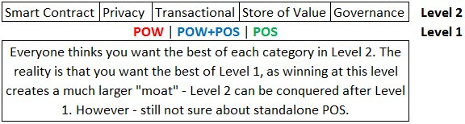

# Episode 2 - Distributed Consensus

**Topic** - Triple Entry Accounting and Consensus Models

**Recording Date** - 28-Feb-2020

**Release Date** - 7-Mar-2020

**Podcast Link** - [Episode 2]() TO BE POPULATED w/ LINK

**Conversation Description** - Mister Black, Checkmate and Permabull Nino discuss the concept of triple entry accounting and how this provides a framework for analysing consensus mechanisms. The theory is that Proof-of-Work, Proof-of-Stake and Hybrid security systems provide different security and ledger assurances.

## Intro (CHECK)

Welcome to Rough Consensus.

This is our experiment with **Honest and Candid conversations** about the cryptocurrency space.

We discuss anything that comes to mind regarding **Fundamentals, Technicals and On-chain Analysis**.

I'm joined by my good friends Permabull Nino and Mister Black, gentlemen, how are we doing?

## Intro Discussion Notes (BLACK):

In Today's episode, we will be exploring the nature of distributed consensus and how different networks go about achieving it and maintaining network security.

Look at PoW, PoS and Hybrid systems with some of the market leading protocols as examples.

## Opening Discussion - Global Markets
    
    - How will crypto fair?

## Topics for discussion (BLACK TO INTRODUCE):

What is Triple entry accounting and ledger assurances and how do they influence the security of a network?

- **NINO:** Difference between double and triple (Ian Grigg)
- How consensus mechanisms provide different assurances

GENERAL STRATEGY FOR EACH CONSENSUS MECHANISM

- The Mechanics
- The Economics
- The Advantages
- The Limitations

### Proof of Work

**BLACK:** PoW is the best known and most battle hardened consensus mechanism. How has it been implemented in Bitcoin and other CC's and what characteristics give it the staying power?

- Bitcoin as the premier pure PoW protocol
- PoW is perfect for keeping already defined rules
- PoW is poor at creating new rules and adaptation (feature and bug)
- Difficulty adjustment controls supply
- Distributed PoW as energy buyer of last resort
- PoW is likely to be a single chain due to the physical expense

**Thoughts on ASICs vs GPU/CPUs**
    
**Impact of ProgPOW for and against**

### Proof of Stake

PoS is often touted as the main alternative to PoW requiring commitment of capital stake rather than electricity and specialised equipment. How does PoS achieve consensus and how do its ledger assurances compare to PoW?

- PoS is equally wasteful as PoW (Marginal Cost = Marginal Revenue)
    - Auctioning off a briefcase of money, bid will be just under value
- Ethereum and Tezos as competitors for pure PoS
- Tezos is live, Ethereum 2.0 still underway
- Risks of DeFi and lending as equivalent to rented hash-rate

### Hybrid consensus mechanisms 
    
- Decred and Dash are the main examples of Hybridised PoW/PoS consensuseach with their own trade-offs and design ethos.
- Decred as the most elegant implementation of Hybrid PoW/PoS
- Advantages and limitations of PoW, PoS and how Hybrid consensusresolves
    - Miner centralisation
    - Governance potential
    - Checks and Balances
    - Solves Nothing at Stake

## Community Questions

1. Lewis Harland - To what extent does securing Decred (PoS) by constantly buying tickets deter ordinary users to participate/support the network in the long term? Are there tradeoffs (if any)?
